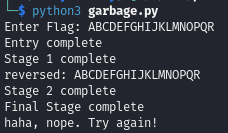
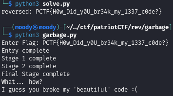

### Reversing a short python script
#### Patriot CTF rev Python Garbage Compiler

Seeing past distractions to understand and reverse a simple python script.

This will be slightly less complicated than some other writeups on here, but it is a normal style of challenge so I figured I would create a writeup for at least one of these python reversing challenges.
<!-- more -->

This was a medium reversing challenge during Patriot CTF 2023. The files provided were the python script and the output inside of a zip file.

{}

When first opening the python script, it looks very messy. However, we quickly realize that most of the chaos comes from comments, that we can simply delete. Search-replacing `#*\n` with `\n` worked very well for me.

At this point we can clearly see that the program hass 4 functions - entry, stage1, stage2 and finalstage. The most important thing in these challenges is often to not worry too much about future issues, such as the file importing random or a certain function looking weird. When we have such short functions, it is much better to just reverse one function at a time.

Main only calls the entry function on our input, and matches that to the contents of output.txt, meaning that if we provide the flag as input, the script will let us know that we are correct.

The entry function is very simple, but we can use it to demonstrate how we are going to reverse the rest of the program. All entry does is reverse the input and call stage1.

```py
def entry(f): 
    seed(10) 
    f = list(f) 
    f.reverse() 
    f = "".join(i for i in f) 
    print("Entry complete") 
    flag = stage1(f) 
    return flag 
```

This means that all our entry reversing need to do is reverse the input from stage1:

```py
def rev_entry(r):
    flag = list(r)
    flag.reverse()
    flag = "".join(x for x in flag) 
    return flag
```

Stage 1 has more contents than entry, but is not much more difficult.

```py
def stage1(a): 
    a = list(a) 
    b = list(string.ascii_lowercase) 
    for o in range(len(a)): 
        a[o] = chr(ord(a[o])^o) 
    z = "".join(x for x in a) 
    for y in range(len(z)): 
        b[y%len(b)] = chr((ord(z[y])^ord(a[y]))+len(b)) # this only changes b, which is never used again
    print("Stage 1 complete") 
    flag = stage2(z) 
    return flag 
```

As you can see from my comment: in the last for loop no changes are made to z, which is what is used in stage2. This means that we can ignore that part. The z variable is just a concatenation of a, and a comes from the input from the entry function. the only change made to a is that each character is xored with its index, before being placed in z. I generally recommend renaming the variables to something more readable before trying to reverse something.

It is very common that the only property of xor we need to know for these challenges is that if x ^ y = secret, then secret ^ x = y and secret ^ y = x. Based on this information, the following will reverse all of stage1.

```py
def rev_stage1(r):
    r = list(r)
    for i in range(len(r)): 
        r[i] = chr(ord(r[i])^i) 
    r = "".join(x for x in r) 
    return r
```

We can confirm that we are correct so far by creating a rev function containing our two reversing functions, and adding `rev(z)` right after stage 1 prints "Stage 1 complete".

```py
def rev(r):
    r = rev_stage1(r)
    r = rev_entry(r)
    print("reversed: " + r)
```

If we run this with "ABCDEFGHIJKLMNOPQR" as our input, we should see that our flag is wrong (of course), but if we have reversed correctly we should see our input again after "Stage 1 complete".



We can see from the output above, that our reversing works so far. Let's keep going.

Stage 2 gets slightly more tricky, but it is still not particularily complicated.

```py
def stage2(b): 
    t = "++++++++++[>+>+++>+++++++>++++++++++<<<<-]>>>>++.++++++.-----------.++++++."[-15:(7*9)].strip('-') 
    for q in range(len(b)): 
        t += chr(ord(b[q])-randint(0,5)) 
    print("Stage 2 complete") 
    flag = finalstage(t) 
    return flag 
```

The t variable is just an obfuscated way of creating an empty string (print it for debugging if you need proof). Everything that is changed in our flag is that each characters ascii value is subtracted by a random integer between 0 and 5. However, we saw the `seed(10)` function in stage1. When random is seeded with the same value, it will provide the same outputs in the same order every time. This is why it is common to seed with the current time in milliseconds, or something else that is known to change. We don't need to know the exact numbers, we can simply seed random with the same number and add randint(0,5) to each character of the flag to reverse it.

```py
def rev_stage2(r):
    seed(10)
    inp = ""
    for q in range(len(r)): 
        inp += chr(ord(r[q])+randint(0,5)) 
    return inp
```

If you want, you can confirm that this works by adding `r = rev_stage2(r)` to the start of our rev function, and moving rev to the end of stage 2 (right after it prints "Stage 2 complete"). All that is left now is to reverse the finalstage function.

```py
def finalstage(w): 
    h=0 
    w = list(w) 
    w.reverse() 
    w = "".join(g for g in w) 
    flag = 'flag'.replace('flag', 'galf').replace('galf', '') 
    while h < len(w): 
        try: 
            flag += w[h+1] + w[h] 
        except: 
            flag += w[h] 
        h+=2 
    print("Final Stage complete") 
    return flag 
```

This function first reverses the input and then it creates flag as an empty string (slightly obfuscated again). It fills flag with the reversed input, however it switches every two characters while possible with `flag += w[h+1] + w[h]`. This means that for example "ABCDEFG" would become "BADCFEG". "G" would not be changed as there is nothing to swap with. If we were to do it again "BADCFEG" would become "ABCDEFG", so it reverses itself!

We can simply steal the while loop from the original script and remember to reverse the flag at the end.

```py
def rev_finalstage(r):
    flag = ""
    i = 0
    while i < len(r): 
        try: 
            flag += r[i+1] + r[i] 
        except: 
            flag += r[i] 
        i+=2 

    flag = list(flag) 
    flag.reverse() 
    flag = "".join(g for g in flag) 
    return flag
```

We now have a reversing script for each function, so if we run the following we should get the flag.

```py
def rev(r):
    r = rev_finalstage(r)
    r = rev_stage2(r)
    r = rev_stage1(r)
    r = rev_entry(r)
    print("reversed: " + r)

flag = open('output.txt', 'r').readlines()[0] 
rev(flag)
```

If, for some reason, you still aren't sure that the flag is correct, you can send it as input to garbage.py for confirmation.



## Full Reversing Script

```py
from random import * 

def rev_entry(r):
    flag = list(r)
    flag.reverse()
    flag = "".join(x for x in flag) 
    return flag

def rev_stage1(r):
    r = list(r)
    for i in range(len(r)): 
        r[i] = chr(ord(r[i])^i) 
    r = "".join(x for x in r) 
    return r

def rev_stage2(r):
    seed(10)
    inp = ""
    for q in range(len(r)): 
        inp += chr(ord(r[q])+randint(0,5)) 
    return inp

def rev_finalstage(r):
    flag = ""
    i = 0
    while i < len(r): 
        try: 
            flag += r[i+1] + r[i] 
        except: 
            flag += r[i] 
        i+=2 

    flag = list(flag) 
    flag.reverse() 
    flag = "".join(g for g in flag) 
    return flag

def rev(r):
    r = rev_finalstage(r)
    r = rev_stage2(r)
    r = rev_stage1(r)
    r = rev_entry(r)
    print("reversed: " + r)

flag = open('output.txt', 'r').readlines()[0] 
rev(flag)
```