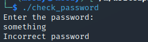
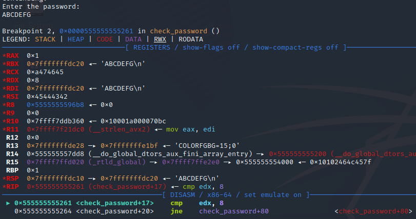
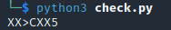
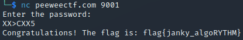

Bruteforcing the password with python to get a flag on the server.
This was the last reversing challenge of the PWC CTF NTNU Trondheim 2023. The only file provided was the elf executable.
 <!--more-->

{}

When running the executable and inputting something, it outputs incorrect password.



Let's open it in ghidra and check what it does. It seems to contain two functions: main and check_password. After renaming some variables the interesting part of main looks like this:

```c
  puts("Enter the password:");
  fflush(stdout);
  fgets(input,100,stdin);
  local_85 = 0;
  check = check_password(input);
  if (check == 0) {
    flag_fd = fopen("flag.txt","r");
    fgets(flag,100,flag_fd);
    printf("Congratulations! The flag is: %s\n",flag);
    fflush(stdout);
  }
  else {
    puts("Incorrect password");
    fflush(stdout);
  }
```

We can see that it calls check_password on our input so lets check what that looks like:

```c
int check_password(char *input)

{
  size_t len;
  undefined8 correct;
  
  len = strlen(input);
  correct = 1;
  if ((int)len == 8) {
    if ((input[2] + -0x30) * 7 - (input[3] * 5 + -0xf0) != 3) {
      return 2;
    }
    correct = 3;
    if ((input[6] + -0x30) * -0xb + (input[2] + -0x30) * 4 == 1) {
      correct = 0;
    }
  }
  return correct;
}
```

`check_password` first checks that our input has the length of 8, then it uses it in two if statements. As we can see from main, we need it to return 0 to read flag.txt, so after passing the length check we have to avoid the first if and enter the second if. This is a weird check as it only uses three of the characters in our password, but we don't mind. We do not want to enter the first if so we can negate the first equation, and try to find a combination that matches the following set of linear diophantine equations (with x as the third letter of our input, y as the fourth and z as the seventh):

**7*(x-48) - (5y - 240) = 3**

**-11*(z-48) + 4*(x - 48) = 1**

I originally thought that I would have to input 8 character for strlen to return 8, but after checking with gdb it turns out we only need 7:



As we can see, when entering 7 characters ("ABCDEFG") and breaking at the length check in `check_password` we can see 8 stored in rdx and the next instructiong being `cmp edx, 8`.

We know that we need to input 7 characters and our third, fourth and seventh character has to match the constraints in check_password. Considering every variable is going to be a valid ascii character the possible scope narrows a lot, and we van simply bruteforce until we find the valid solution. The following script loops through the possible values and crafts a password to pass the checks:

```py
code = list("X"*7)

# 7*(x-48) - (5y - 240) = 3
# -11*(z-48) + 4*(x - 48) = 1

for x in range(0x20,0x7f):
  for y in range(0x20,0x7f):
    if 7 * (x - 48) - (5 * y - 240) == 3:
      for z in range(0x20,0x7f):
        if -11 * (z - 48) + 4* (x - 48) == 1:
          code[2] = chr(x)
          code[3] = chr(y)
          code[6] = chr(z)
          print("".join(code))
```



When running the script, it almost instantly returns "XX>CXX5". Now all we have to do is send our password to the server and claim our flag.




