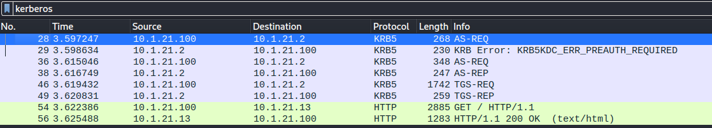
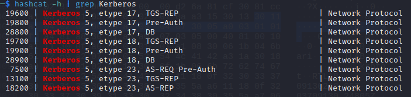
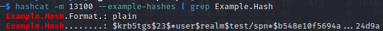
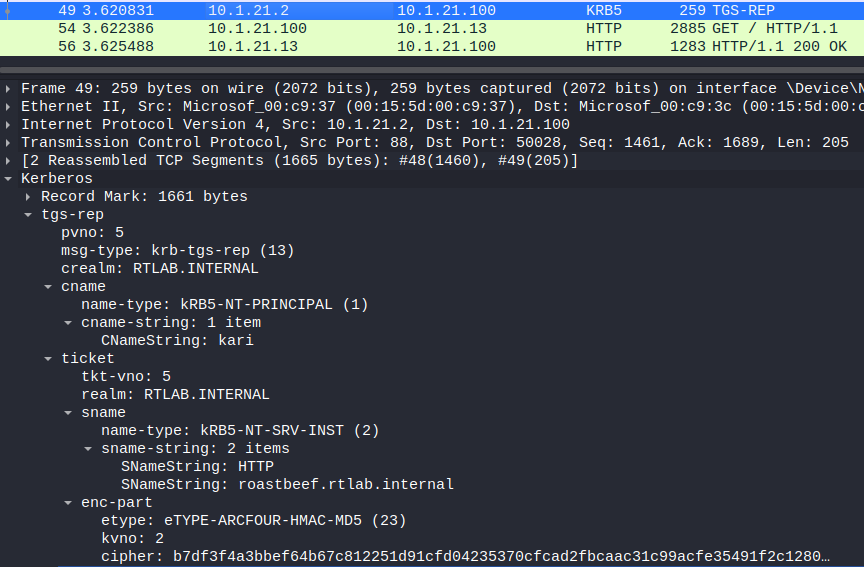
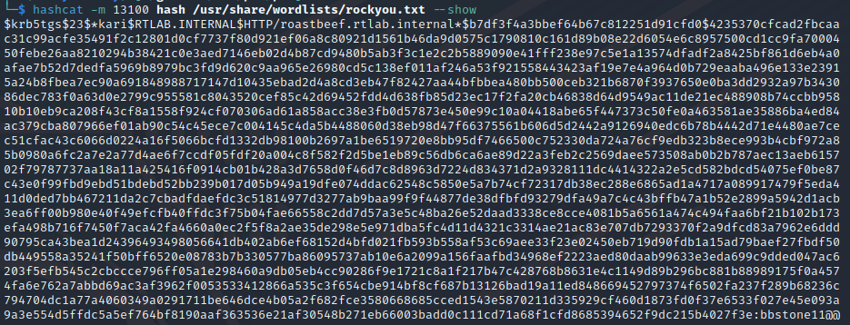

### Kerberos hash cracking from pcap
#### PWC forensics Roast Beef

This challenge provided a pcapng capture of a kerberos authentication request, and our task was to crack the password used in this request.
 <!--more-->

It was one of the two 500 point challenges from the PWC CTF NTNU Trondheim 2023, and noone sloved it during the event.
I solved it after the event with a lot of support and research from https://github.com/felixalbrigtsen.

{}

The first thing I always do when opening a capture in wireshark containing http is to download the http objects through File > Export Objects > HTTP. I should probably get used to reviewing the traffic more thoroughly first, however I have gotten a lot of easy point this way so we'll see...

Anyway, looking at the exported http objects there are two http responses containing 401 - Unauthorized and a final response containing a screenshot of a Windows IIS dashboard. This should be a pretty clear hint that the challenge is windows and authentication related.

Looking closer at the capture in wireshark, we see the two 401 - Unauthorized responses, followed by som kerberos traffic (KRB5). Filtering by kerberos we see the following traffic:



I am not very familiar with the kerberos protocol, but I learned that one of the most common attacks against it is Kerberoasting. This combined with the challenge name means that it is the right path. The first part of a kerberoasting attack is to extract a hash from the captured traffic. The second part is to crack that hash and find a password.

To create our hash we need to know what were looking for. According to the hashcat manual there are many different types of hashes:



We can see many different types of hashes. I took a lot of inspiration from https://blog.xpnsec.com/kerberos-attacks-part-1/, and the hash cracked in that guide was a TGS-REP 23, so I will try to use that. We can use the --example-hashes flag combined with the mode in hashcat to see what our hash needs to look like. 



Our hash needs to be in the format `$krb5tgs$<ENCRYPTION_TYPE>$*<USERNAME>$<REALM>$<SPN>*$<FIRST_16_BYTES_TICKET>$<REMAINING_TICKET_BYTES>`. All of this information can be found in the TGS-REP in wireshark.



Here we can see the enxryption type 23 (at the end of the etype line), the username kari, the realm RTLAB.INTERNAL, the spn HTTP/roastbeef.rtlab.internal (from the sname-strings) and finally the ticket bytes (cipher) at the end. Putting it all together, and remembering to insert a dollar sign after 16 bytes (32 hex characters), our hash becomes this:

```
$krb5tgs$23$*kari$RTLAB.INTERNAL$HTTP/roastbeef.rtlab.internal*$b7df3f4a3bbef64b67c812251d91cfd0$4235370cfcad2fbcaac31c99acfe35491f2c12801d0cf7737f80d921ef06a8c80921d1561b46da9d0575c1790810c161d89b08e22d6054e6c8957500cd1cc9fa7000450febe26aa8210294b38421c0e3aed7146eb02d4b87cd9480b5ab3f3c1e2c2b5889090e41fff238e97c5e1a13574dfadf2a8425bf861d6eb4a0afae7b52d7dedfa5969b8979bc3fd9d620c9aa965e26980cd5c138ef011af246a53f921558443423af19e7e4a964d0b729eaaba496e133e23915a24b8fbea7ec90a691848988717147d10435ebad2d4a8cd3eb47f82427aa44bfbbea480bb500ceb321b6870f3937650e0ba3dd2932a97b343086dec783f0a63d0e2799c955581c8043520cef85c42d69452fdd4d638fb85d23ec17f2fa20cb46838d64d9549ac11de21ec488908b74ccbb95810b10eb9ca208f43cf8a1558f924cf070306ad61a858acc38e3fb0d57873e450e99c10a04418abe65f447373c50fe0a463581ae35886ba4ed84ac379cba807966ef01ab90c54c45ece7c004145c4da5b4488060d38eb98d47f66375561b606d5d2442a9126940edc6b78b4442d71e4480ae7cec51cfac43c6066d0224a16f5066bcfd1332db98100b2697a1be6519720e8bb95df7466500c752330da724a76cf9edb323b8ece993b4cbf972a85b0980a6fc2a7e2a77d4ae6f7ccdf05fdf20a004c8f582f2d5be1eb89c56db6ca6ae89d22a3feb2c2569daee573508ab0b2b787aec13aeb615702f79787737aa18a11a425416f0914cb01b428a3d7658d0f46d7c8d8963d7224d834371d2a9328111dc4414322a2e5cd582bdcd54075ef0be87c43e0f99fbd9ebd51bdebd52bb239b017d05b949a19dfe074ddac62548c5850e5a7b74cf72317db38ec288e6865ad1a4717a089917479f5eda411d0ded7bb467211da2c7cbadfdaefdc3c51814977d3277ab9baa99f9f44877de38dfbfd93279dfa49a7c4c43bffb47a1b52e2899a5942d1acb3ea6ff00b980e40f49efcfb40ffdc3f75b04fae66558c2dd7d57a3e5c48ba26e52daad3338ce8cce4081b5a6561a474c494faa6bf21b102b173efa498b716f7450f7aca42fa4660a0ec2f5f8a2ae35de298e5e971dba5fc4d11d4321c3314ae21ac83e707db7293370f2a9dfcd83a7962e6ddd90795ca43bea1d24396493498056641db402ab6ef68152d4bfd021fb593b558af53c69aee33f23e02450eb719d90fdb1a15ad79baef27fbdf50db449558a35241f50bff6520e08783b7b330577ba86095737ab10e6a2099a156faafbd34968ef2223aed80daab99633e3eda699c9dded047ac6203f5efb545c2cbccce796ff05a1e298460a9db05eb4cc90286f9e1721c8a1f217b47c428768b8631e4c1149d89b296bc881b88989175f0a4574fa6e762a7abbd69ac3af3962f0053533412866a535c3f654cbe914bf8cf687b13126bad19a11ed848669452797374f6502fa237f289b68236c794704dc1a77a4060349a0291711be646dce4b05a2f682fce3580668685cced1543e5870211d335929cf460d1873fd0f37e6533f027e45e093a9a3e554d5ffdc5a5ef764bf8190aaf363536e21af30548b271eb66003badd0c111cd71a68f1cfd8685394652f9dc215b4027f3e
```

Echoing this into a file and running hashcat on it with rockyou as our wordlist gives us the password `bbstone11@@`, and combining this with the flag format `flag{ThePasswordYouFound}` the flag becomes `flag{bbstone11@@}`.


