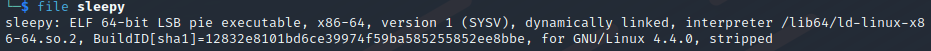
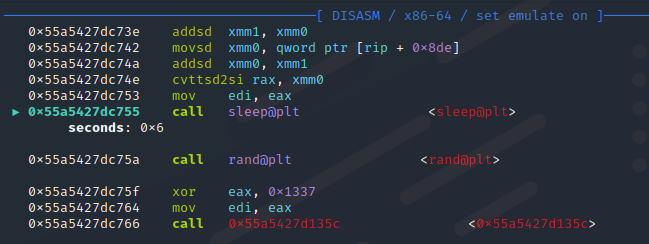
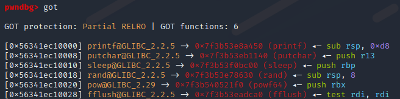
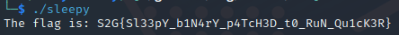

### Patching libc_sleep to speed up a binary
#### S2G rev Sleepy challenge

Patching an ELF with exponential sleeping, to run faster and print the flag.
 <!--more-->

This was one of the reversing challenges from the S2G web CTF, and I thought the gdb tricks used were worth sharing. The only file provided was the sleepy binary.

{}

Running the binary gives the following output:

It starts printing the flag, which is great, but it writes more slowly for each letter it gives us. Let's open it in gdb and see what it's doing. Running file on the binary lets us know its stripped, so we cant simply set a breakpoint at the start of main (as there are no symbols).

I devide to run the binary in one terminal, find the process with `ps aux | grep sleepy` and attach gdb with `gdb -p <pid>` in another terminal. We enter into a sleep, which explains why the binary is so slow. Stepping through the instructions with `ni` eventually gets us to instructions that gdb can't place in a known function, so we're out of the libc functions, and most likely in the interesting part of the binary. We can keep stepping through to look for something interesting. At one point it prints a letter, and then we reach a sleep.

We see that on this call it's going to sleep for 6 seconds. Setting a breakpoint at the instruction calling sleep and continuing eventually shows us that the next time it is going to sleep for 7 seconds and then 9, and we can only assume it is going to keep increasing. It is therefore unreasonable to try to wait for the program to finish, and we will have to speed it up somehow. The way I did it during the competition was setting rdi to 0 on every breakpoint and spamming continue until the flag was printed. This works because rdi will be the first argument to sleep, meaning that I would cause the program to sleep for 0 seconds every time.

In this writeup I will demonstrate a much cooler solution, overwriting sleep in the got, to instead ret immmediately every time. The way the Global Offset Table works is that it contains entries pointing to its corresponding functions in libc. We can easily view all of the entries in gdb:

If we set the address of sleep in got (**0x56341ec10010**) to instead point to an instruction that returns immediately, we should be able to just continue and get the flag. `rop` in gdb can be used to found useful gadgets, and adding `--grep ret` lets us search for what we want. I find **0x00007f3b53e698bf : nop ; ret** which looks like it could work, as it only contains a no operation instruction before returning. `set *<address of sleep in got>=<address of nop; ret>` will overwrite the sleep function in the got.

As we can see above, after overwriting sleep and continuing the program completes immediately and it prints put the entire flag in the other terminal window!

